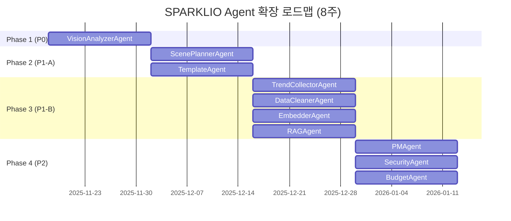
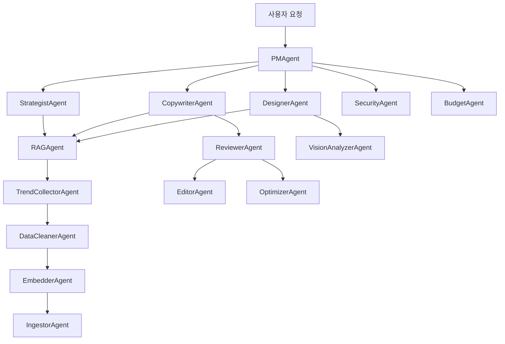

# SPARKLIO Agent 구조 분석 및 확장 플랜

**작성일**: 2025-11-18
**작성자**: B팀 (Backend Team)
**문서 버전**: v1.0
**상태**: 최종 확정

---

## 📋 목차

1. [Executive Summary](#executive-summary)
2. [현재 Agent 구조 분석](#현재-agent-구조-분석)
3. [AGENTS_SPEC 기반 확장 Agent 목록](#agents_spec-기반-확장-agent-목록)
4. [Agent 확장 플랜 (우선순위 및 일정)](#agent-확장-플랜)
5. [기술적 고려사항](#기술적-고려사항)
6. [리스크 및 대응방안](#리스크-및-대응방안)

---

## Executive Summary

### 🎯 핵심 요약 (30초)

- **현재 구현**: 6개 Agent + Workflow Orchestrator (완성도 70%)
- **SPEC 목표**: 16개 Agent (Creation 9개 + Intelligence 7개 + System 4개)
- **확장 필요**: 10개 Agent 추가 구현
- **예상 기간**: 8주 (Phase별 2주씩)
- **우선순위**: P0 (Creation Agents) → P1 (Intelligence Agents) → P2 (System Agents)

### 📊 현황 요약

| 구분 | 현재 | 목표 (SPEC) | Gap | 상태 |
|-----|------|------------|-----|------|
| **Creation Agents** | 6개 | 9개 | +3개 | 66% 완료 |
| **Intelligence Agents** | 0개 | 7개 | +7개 | 0% 완료 |
| **System Agents** | 0개 | 4개 | +4개 | 0% 완료 |
| **합계** | 6개 | 20개 | +14개 | 30% 완료 |

---

## 현재 Agent 구조 분석

### 1. 구현 완료된 Agent (6개)

#### 1.1 CopywriterAgent
- **위치**: `app/services/agents/copywriter.py`
- **역할**: 텍스트 콘텐츠 생성 (제품 설명, SNS 카피, 광고 문구)
- **지원 작업**:
  - `product_detail`: 제품 상세 설명
  - `sns`: SNS 게시물 카피
  - `brand_message`: 브랜드 메시지
  - `headline`: 헤드라인 생성
  - `ad_copy`: 광고 카피
- **LLM 연동**: ✅ Ollama (Qwen2.5:7b)
- **완성도**: ⭐⭐⭐⭐⭐ (100%)

#### 1.2 StrategistAgent
- **위치**: `app/services/agents/strategist.py`
- **역할**: 마케팅 전략 수립 및 콘텐츠 구조 설계
- **지원 작업**:
  - `brand_kit`: 브랜드 키트 생성
  - `campaign`: 캠페인 기획
  - `target_analysis`: 타겟 분석
  - `positioning`: 포지셔닝
  - `content_strategy`: 콘텐츠 전략
- **LLM 연동**: ✅ Ollama
- **완성도**: ⭐⭐⭐⭐⭐ (100%)

#### 1.3 DesignerAgent
- **위치**: `app/services/agents/designer.py`
- **역할**: 비주얼 콘텐츠 생성 (제품 이미지, 로고, 썸네일)
- **지원 작업**:
  - `product_image`: 제품 이미지
  - `brand_logo`: 브랜드 로고
  - `sns_thumbnail`: SNS 썸네일
  - `ad_banner`: 광고 배너
  - `illustration`: 일러스트레이션
- **Media 연동**: ✅ ComfyUI (Mock 모드 지원)
- **완성도**: ⭐⭐⭐⭐ (90%) - Live ComfyUI 연동 대기

#### 1.4 ReviewerAgent
- **위치**: `app/services/agents/reviewer.py`
- **역할**: 콘텐츠 품질 검토 및 피드백 제공
- **지원 작업**:
  - `content_review`: 콘텐츠 품질 평가
  - `copy_review`: 카피 검토
  - `brand_consistency`: 브랜드 일관성 검사
  - `grammar_check`: 문법 검사
  - `effectiveness_analysis`: 효과성 분석
- **LLM 연동**: ✅ Ollama
- **완성도**: ⭐⭐⭐⭐⭐ (100%)

#### 1.5 OptimizerAgent
- **위치**: `app/services/agents/optimizer.py`
- **역할**: 콘텐츠 최적화 (SEO, 전환율, 가독성)
- **지원 작업**:
  - `seo_optimize`: SEO 최적화
  - `conversion_optimize`: 전환율 최적화
  - `readability_improve`: 가독성 개선
  - `length_adjust`: 길이 조정
  - `tone_adjust`: 톤 조정
- **LLM 연동**: ✅ Ollama
- **완성도**: ⭐⭐⭐⭐⭐ (100%)

#### 1.6 EditorAgent
- **위치**: `app/services/agents/editor.py`
- **역할**: 콘텐츠 편집 및 교정
- **지원 작업**:
  - `proofread`: 교정
  - `rewrite`: 재작성
  - `summarize`: 요약
  - `expand`: 확장
  - `translate`: 번역
- **LLM 연동**: ✅ Ollama
- **완성도**: ⭐⭐⭐⭐⭐ (100%)

---

### 2. Workflow Orchestrator

#### 2.1 구조
- **위치**: `app/services/orchestrator/`
- **핵심 파일**:
  - `base.py`: WorkflowExecutor 기본 클래스
  - `workflows.py`: 사전 정의 워크플로우

#### 2.2 사전 정의 워크플로우 (3개)

**ProductContentWorkflow**
```
Copywriter → Reviewer → Optimizer
```
- 제품 콘텐츠 생성 → 품질 검토 → 최적화

**BrandIdentityWorkflow**
```
Strategist → Copywriter → Reviewer
```
- 브랜드 전략 수립 → 메시지 생성 → 일관성 검토

**ContentReviewWorkflow**
```
Reviewer → Editor → Reviewer (재검토)
```
- 콘텐츠 검토 → 교정 → 재검토

#### 2.3 워크플로우 실행 방식
- **Sequential**: 순차 실행 (Step 0 → Step 1 → Step 2)
- **Parallel**: 병렬 실행 (향후 지원 예정)
- **변수 치환**: `${initial.*}`, `${step_N.outputs[*].value}` 지원

---

### 3. 기반 아키텍처

#### 3.1 공통 인터페이스

**AgentRequest**
```python
{
  "task": "product_detail",
  "payload": {
    "product_name": "무선 이어폰",
    "features": ["노이즈캔슬링"],
    "target_audience": "2030 직장인"
  },
  "options": {
    "tone": "professional",
    "length": "medium"
  }
}
```

**AgentResponse**
```python
{
  "agent": "copywriter",
  "task": "product_detail",
  "outputs": [
    {
      "type": "json",
      "name": "product_copy",
      "value": {
        "headline": "...",
        "body": "..."
      }
    }
  ],
  "usage": {
    "llm_tokens": 350,
    "elapsed_seconds": 2.5
  },
  "meta": {
    "llm_provider": "ollama",
    "llm_model": "qwen2.5:7b"
  }
}
```

#### 3.2 Gateway 통합
- **LLM Gateway**: Ollama + OpenAI (Smart Router)
- **Media Gateway**: ComfyUI + NanoBanana (향후)
- **Provider 전환**: Mock ↔ Live 자동 전환

---

## AGENTS_SPEC 기반 확장 Agent 목록

### 1. Creation Agents (추가 필요: 3개)

#### 1.1 VisionAnalyzerAgent ⭐ P0
- **역할**: 생성 이미지 품질 평가 및 피드백
- **입력**: 이미지 URL/Base64
- **출력**:
  ```json
  {
    "quality_score": 0.87,
    "analysis": {
      "composition": {"balance": 0.9, "focal_point": "center"},
      "colors": {"brand_match": 0.92, "harmony": 0.88}
    },
    "issues": ["배경 노이즈 약간 있음"],
    "improvements": ["색상 채도 +5%"]
  }
  ```
- **연동**: Vision API (GPT-4V, Claude 3.5 Sonnet)
- **KPI**: Analysis Accuracy > 95%

#### 1.2 ScenePlannerAgent ⭐ P1
- **역할**: 광고 영상·쇼츠의 씬 구성 설계
- **입력**: 제품 정보, 타겟, 길이 (15초/30초/60초)
- **출력**:
  ```json
  {
    "scenes": [
      {
        "id": "scene_001",
        "duration": 3.5,
        "description": "제품 클로즈업 + 자연 배경",
        "shots": [
          {"type": "close_up", "duration": 1.5}
        ]
      }
    ]
  }
  ```
- **연동**: LLM (Qwen2.5)
- **KPI**: Scene Clarity > 85%

#### 1.3 TemplateAgent ⭐ P1
- **역할**: 마케팅 템플릿 자동 생성기
- **입력**: 업종, 채널, 목적
- **출력**:
  ```json
  {
    "template": {
      "id": "tpl_landing_001",
      "structure": {
        "sections": ["hero", "features", "cta"]
      },
      "variables": [
        {"name": "headline", "type": "string"}
      ]
    }
  }
  ```
- **연동**: Template DB + Redis Cache
- **KPI**: Template Reuse Rate > 70%

---

### 2. Intelligence Agents (추가 필요: 7개)

#### 2.1 TrendCollectorAgent ⭐ P1
- **역할**: 트렌드 데이터 크롤링 (Naver, Instagram, YouTube)
- **입력**: 키워드, 업종, 기간
- **출력**:
  ```json
  {
    "collected_data": [
      {
        "source": "naver_trends",
        "keyword": "자연주의",
        "volume": 12500,
        "trend": "rising"
      }
    ],
    "metadata": {
      "total_items": 1250,
      "collection_time": 45.2
    }
  }
  ```
- **연동**: Selenium + BeautifulSoup + API
- **KPI**: Collection Success Rate > 95%

#### 2.2 DataCleanerAgent ⭐ P1
- **역할**: 수집 데이터 정제 (HTML 제거, 중복 제거, OCR)
- **입력**: Raw 크롤링 데이터
- **출력**: 정제된 텍스트 데이터
- **연동**: BeautifulSoup + Tesseract OCR
- **KPI**: Cleaning Accuracy > 95%

#### 2.3 EmbedderAgent ⭐ P1
- **역할**: 텍스트 임베딩 생성 (OpenAI, Llama3.1, BGE)
- **입력**: 텍스트 배열
- **출력**: 임베딩 벡터 배열 (1536차원)
- **연동**: OpenAI API / SentenceTransformers
- **KPI**: Embedding Generation < 1s per 100 texts

#### 2.4 IngestorAgent ⭐ P1
- **역할**: Postgres 저장, Redis 캐싱, S3 업로드
- **입력**: 임베딩 + 메타데이터
- **출력**: 저장 성공 여부
- **연동**: PostgreSQL + Redis + MinIO
- **KPI**: Insertion Rate > 1000 records/sec

#### 2.5 PerformanceAnalyzerAgent ⭐ P2
- **역할**: SNS·광고 성과 데이터 분석
- **입력**: 플랫폼, 게시물 ID
- **출력**:
  ```json
  {
    "metrics": {
      "likes": 1250,
      "comments": 45,
      "engagement_rate": 0.083
    },
    "performance_grade": 0.85,
    "insights": [
      "감성형 짧은 카피의 CTR이 35% 높음"
    ]
  }
  ```
- **연동**: Instagram API, Naver Ad API
- **KPI**: Data Collection Rate > 95%

#### 2.6 SelfLearningAgent ⭐ P2
- **역할**: 사용자 피드백 기반 브랜드 벡터 조정
- **입력**: 브랜드 ID, 피드백 데이터
- **출력**: 업데이트된 브랜드 벡터
- **연동**: PostgreSQL (brand_vectors 테이블)
- **KPI**: Learning Effectiveness > 85%

#### 2.7 RAGAgent ⭐ P1
- **역할**: 지식 검색 및 컨텍스트 제공
- **입력**: 쿼리, 브랜드 ID, top_k
- **출력**:
  ```json
  {
    "results": [
      {
        "content": "비건 화장품 시장은 2025년 35% 성장...",
        "source": "report_2025.pdf",
        "relevance_score": 0.92
      }
    ],
    "summary": "비건 화장품 시장 급성장 중"
  }
  ```
- **연동**: PostgreSQL (pgvector) + Embedding
- **KPI**: Retrieval@10 > 0.85

---

### 3. System Agents (추가 필요: 4개)

#### 3.1 PMAgent ⭐ P2
- **역할**: 전체 워크플로우 조율 및 태스크 분배
- **입력**: 사용자 요청 (자연어)
- **출력**:
  ```json
  {
    "execution_plan": [
      {"agent": "StrategistAgent", "task": "develop_strategy", "priority": "P0"},
      {"agent": "CopywriterAgent", "task": "generate_copy", "priority": "P0"}
    ],
    "estimated_time": 180,
    "estimated_cost": 15000
  }
  ```
- **연동**: Workflow Orchestrator
- **KPI**: Planning Time < 5s

#### 3.2 SecurityAgent ⭐ P2
- **역할**: 민감정보 탐지, 정책 위반 검사
- **입력**: 콘텐츠 (텍스트/이미지)
- **출력**:
  ```json
  {
    "compliance_status": true,
    "violations": [],
    "risk_score": 0.05
  }
  ```
- **연동**: PII Detection Library
- **KPI**: False Positive Rate < 5%

#### 3.3 BudgetAgent ⭐ P2
- **역할**: LLM Token/Cost 추적, 비용 최적화
- **입력**: 프로젝트 ID, 예산 한도
- **출력**:
  ```json
  {
    "current_spend": 12500,
    "projected_spend": 45000,
    "breakdown": {
      "llm_tokens": 8000,
      "image_generation": 3500
    },
    "optimization_opportunities": [
      {"area": "LLM", "potential_savings": 2000}
    ]
  }
  ```
- **연동**: Prometheus + Cost Tracking DB
- **KPI**: Cost Prediction Accuracy ±10%

#### 3.4 ADAgent ⭐ P2
- **역할**: 광고 퍼포먼스 최적화 (Google Ads, Naver, Kakao)
- **입력**: 캠페인 정보, 성과 데이터
- **출력**:
  ```json
  {
    "optimizations": [
      {
        "element": "keyword_bid",
        "current": 500,
        "recommended": 650,
        "expected_impact": "+15% CTR"
      }
    ]
  }
  ```
- **연동**: Google Ads API, Naver Ad API
- **KPI**: ROI Improvement > 20%

---

## Agent 확장 플랜

### 📅 전체 일정 (8주)



---

### Phase 1: P0 Creation Agents (2주)

**목표**: VisionAnalyzerAgent 구현 및 통합

**기간**: 2025-11-18 ~ 2025-12-01 (2주)

**작업 항목**:

| 작업 | 담당 | 소요 | 산출물 |
|-----|-----|------|--------|
| VisionAnalyzerAgent 클래스 구현 | B팀 | 3일 | `app/services/agents/vision_analyzer.py` |
| Vision API 연동 (GPT-4V) | B팀 | 2일 | LLM Gateway 확장 |
| 품질 평가 로직 구현 | B팀 | 2일 | Analysis 알고리즘 |
| 통합 테스트 | A팀 | 2일 | 테스트 케이스 10개 |
| 문서화 | B팀 | 1일 | API 문서 + 사용 가이드 |

**완료 기준**:
- ✅ DesignerAgent 생성 이미지 → VisionAnalyzerAgent 평가 파이프라인 작동
- ✅ 품질 점수 0.0~1.0 정확도 > 90%
- ✅ 10개 테스트 케이스 모두 통과

**리스크**:
- Vision API 비용 (대응: Mock 모드 우선 구현)

---

### Phase 2: P1-A Creation Agents (2주)

**목표**: ScenePlannerAgent, TemplateAgent 구현

**기간**: 2025-12-02 ~ 2025-12-15 (2주)

**작업 항목**:

| 작업 | 담당 | 소요 | 산출물 |
|-----|-----|------|--------|
| ScenePlannerAgent 구현 | B팀 | 3일 | Scene 구성 로직 |
| TemplateAgent 구현 | B팀 | 3일 | Template 생성 로직 |
| Template DB 스키마 설계 | B팀 | 1일 | Migration 파일 |
| Redis Template 캐싱 | B팀 | 1일 | Cache Layer |
| 통합 테스트 | A팀 | 2일 | 테스트 케이스 15개 |

**완료 기준**:
- ✅ ScenePlannerAgent가 15초/30초/60초 영상 씬 생성
- ✅ TemplateAgent가 업종별 템플릿 자동 생성
- ✅ Template 재사용률 > 70%

---

### Phase 3: P1-B Intelligence Agents (2주)

**목표**: 데이터 파이프라인 Agent 4종 구현

**기간**: 2025-12-16 ~ 2025-12-29 (2주)

**작업 항목**:

| 작업 | 담당 | 소요 | 산출물 |
|-----|-----|------|--------|
| TrendCollectorAgent 구현 | B팀 | 3일 | 크롤러 (Naver, Instagram) |
| DataCleanerAgent 구현 | B팀 | 2일 | HTML/OCR 정제 |
| EmbedderAgent 구현 | B팀 | 2일 | OpenAI Embedding 연동 |
| IngestorAgent 구현 | B팀 | 1일 | DB/Cache 저장 |
| RAGAgent 구현 | B팀 | 2일 | pgvector 검색 |
| 통합 테스트 | A팀 | 2일 | E2E 파이프라인 테스트 |

**완료 기준**:
- ✅ Trend 크롤링 → 정제 → 임베딩 → 저장 → RAG 검색 전체 파이프라인 작동
- ✅ 검색 정확도 (Retrieval@10) > 0.85
- ✅ 처리 속도 > 1000 records/sec

**리스크**:
- 크롤링 차단 (대응: User-Agent 로테이션, Rate Limiting)

---

### Phase 4: P2 System Agents (2주)

**목표**: 시스템 안정성 Agent 4종 구현

**기간**: 2025-12-30 ~ 2026-01-12 (2주)

**작업 항목**:

| 작업 | 담당 | 소요 | 산출물 |
|-----|-----|------|--------|
| PMAgent 구현 | B팀 | 3일 | 워크플로우 자동 조율 |
| SecurityAgent 구현 | B팀 | 2일 | PII 탐지 로직 |
| BudgetAgent 구현 | B팀 | 2일 | Cost Tracking |
| ADAgent 구현 | B팀 | 2일 | 광고 API 연동 |
| 통합 테스트 | A팀 | 1일 | 테스트 케이스 10개 |

**완료 기준**:
- ✅ PMAgent가 자연어 요청 → 워크플로우 자동 계획
- ✅ SecurityAgent PII 탐지 정확도 > 98%
- ✅ BudgetAgent 비용 예측 오차 < ±10%
- ✅ ADAgent 광고 최적화 ROI 개선 > 20%

---

## 기술적 고려사항

### 1. LLM Provider 전략

**현재 상태**:
- Primary: Ollama (Qwen2.5:7b) - 로컬
- Fallback: OpenAI (GPT-4o-mini) - API

**확장 Agent별 Provider 권장**:

| Agent | Primary | Fallback | 이유 |
|-------|---------|----------|------|
| VisionAnalyzerAgent | GPT-4V | Claude 3.5 Sonnet | Vision 분석 정확도 |
| ScenePlannerAgent | Qwen2.5 | GPT-4o-mini | 구조화된 JSON 출력 |
| TrendCollectorAgent | N/A (Crawler) | - | 크롤링 전용 |
| EmbedderAgent | OpenAI (text-embedding-3-large) | BGE-M3 | 임베딩 품질 |
| PMAgent | GPT-4o | Claude 3.5 Sonnet | 복잡한 추론 능력 |

**비용 최적화**:
- Mock 모드 우선 개발 → Live 모드 전환 (Phase별)
- Local Model (Ollama) 최대 활용
- API 호출은 캐싱 + Rate Limiting

---

### 2. Database 스키마 확장

**추가 필요 테이블**:

#### 2.1 `trend_data` (TrendCollectorAgent)
```sql
CREATE TABLE trend_data (
    id UUID PRIMARY KEY DEFAULT gen_random_uuid(),
    source VARCHAR(50) NOT NULL,
    keyword VARCHAR(255) NOT NULL,
    volume INTEGER,
    trend VARCHAR(20),
    collected_at TIMESTAMP DEFAULT NOW(),
    raw_data JSONB
);

CREATE INDEX idx_trend_keyword ON trend_data(keyword);
CREATE INDEX idx_trend_collected_at ON trend_data(collected_at);
```

#### 2.2 `embeddings` (EmbedderAgent)
```sql
CREATE TABLE embeddings (
    id UUID PRIMARY KEY DEFAULT gen_random_uuid(),
    text TEXT NOT NULL,
    embedding VECTOR(1536) NOT NULL,
    source VARCHAR(255),
    metadata JSONB,
    created_at TIMESTAMP DEFAULT NOW()
);

CREATE INDEX idx_embedding_vector ON embeddings USING ivfflat (embedding vector_cosine_ops);
```

#### 2.3 `templates` (TemplateAgent)
```sql
CREATE TABLE templates (
    id UUID PRIMARY KEY DEFAULT gen_random_uuid(),
    template_id VARCHAR(255) UNIQUE NOT NULL,
    type VARCHAR(50) NOT NULL,
    industry TEXT[] DEFAULT '{}',
    channel TEXT[] DEFAULT '{}',
    document_json JSONB NOT NULL,
    status VARCHAR(20) DEFAULT 'draft',
    created_at TIMESTAMP DEFAULT NOW()
);

CREATE INDEX idx_templates_type ON templates(type);
CREATE INDEX idx_templates_status ON templates(status);
```

#### 2.4 `cost_tracking` (BudgetAgent)
```sql
CREATE TABLE cost_tracking (
    id UUID PRIMARY KEY DEFAULT gen_random_uuid(),
    project_id UUID REFERENCES projects(id),
    agent VARCHAR(50),
    operation VARCHAR(50),
    tokens_used INTEGER,
    cost DECIMAL(10, 4),
    timestamp TIMESTAMP DEFAULT NOW()
);

CREATE INDEX idx_cost_project ON cost_tracking(project_id);
CREATE INDEX idx_cost_timestamp ON cost_tracking(timestamp);
```

---

### 3. Redis 캐싱 전략

**캐시 대상**:

| 데이터 | TTL | 키 형식 | 이유 |
|--------|-----|---------|------|
| Templates (Approved) | 1시간 | `tpl:approved:{id}` | 자주 조회됨 |
| Brand Learning Vector | 6시간 | `brand:vector:{brand_id}` | 변경 빈도 낮음 |
| Trend Data (최근 1주) | 30분 | `trend:{keyword}:{date}` | 실시간성 중요 |
| RAG Embedding Cache | 24시간 | `emb:{text_hash}` | 재계산 비용 큼 |

**캐시 무효화 정책**:
- Template 수정 시: 즉시 무효화
- Brand Vector 업데이트 시: 즉시 무효화
- Trend Data: 자동 만료 (TTL)

---

### 4. Celery Task Queue 설계

**Queue 우선순위**:

| Queue | Priority | Agent | SLA |
|-------|----------|-------|-----|
| `pm_queue` | 10 (최고) | PMAgent | < 5초 |
| `strategy_queue` | 9 | StrategistAgent | < 10초 |
| `content_queue` | 8 | CopywriterAgent, EditorAgent | < 15초 |
| `vision_queue` | 7 | DesignerAgent, VisionAnalyzerAgent | < 30초 |
| `intelligence_queue` | 5 | RAGAgent, TrendCollectorAgent | < 60초 |
| `system_queue` | 4 | SecurityAgent, BudgetAgent | < 60초 |

**재시도 전략**:
```python
RETRY_CONFIG = {
    "max_attempts": 3,
    "backoff": "exponential",
    "base_delay": 1.0,
    "max_delay": 60.0,
    "retryable_errors": [
        "TIMEOUT",
        "MODEL_ERROR",
        "QUOTA_EXCEEDED"
    ]
}
```

---

## 리스크 및 대응방안

### 1. 기술 리스크

#### 1.1 Vision API 비용 폭증
**리스크**: GPT-4V 호출 비용 높음 (이미지 1개당 $0.02~0.05)

**대응**:
- Phase 1: Mock VisionAnalyzer 우선 구현 (더미 점수 반환)
- Phase 2: 로컬 Vision Model (LLaVA, CogVLM) 검토
- Phase 3: 캐싱 강화 (동일 이미지 재평가 방지)
- 예산 한도 설정: 월 $100

**책임자**: B팀 리더
**모니터링**: 주간 비용 리포트

---

#### 1.2 크롤링 차단
**리스크**: Naver, Instagram 크롤링 시 IP 차단 가능

**대응**:
- User-Agent 로테이션 (10개 이상)
- Rate Limiting: 1 req/5sec
- Proxy 서버 활용 (필요 시)
- 공식 API 우선 사용 (Naver Search API)

**책임자**: TrendCollectorAgent 담당자
**모니터링**: 일일 크롤링 성공률 확인

---

#### 1.3 Embedding 성능 병목
**리스크**: OpenAI Embedding API 호출 시간 (100개 텍스트당 ~5초)

**대응**:
- 배치 처리: 최대 2048개 텍스트 한 번에 처리
- 로컬 임베딩 모델 (BGE-M3) 병행 사용
- Redis 캐싱: 동일 텍스트 재임베딩 방지

**책임자**: EmbedderAgent 담당자
**모니터링**: P95 Latency < 10초 유지

---

### 2. 일정 리스크

#### 2.1 Phase 3 Intelligence Agents 일정 지연
**리스크**: 4개 Agent 동시 구현 → 복잡도 높음

**대응**:
- 병렬 개발: 2명 투입 (TrendCollector+DataCleaner / Embedder+RAG)
- 우선순위 조정: RAGAgent 우선 완성 (다른 Agent 의존도 높음)
- 버퍼 1주 추가 (12/30~01/05)

**책임자**: B팀 PM
**모니터링**: 주간 스프린트 리뷰

---

#### 2.2 API 연동 지연 (ADAgent)
**리스크**: Google Ads API, Naver Ad API 승인 지연 가능

**대응**:
- Phase 4 시작 전 API 신청 (12월 초)
- Mock API 우선 구현
- API 승인 대기 중에도 로직 개발 진행

**책임자**: ADAgent 담당자
**모니터링**: API 승인 상태 주간 체크

---

### 3. 품질 리스크

#### 3.1 Agent 간 일관성 문제
**리스크**: 16개 Agent가 서로 다른 출력 형식 사용 → 통합 어려움

**대응**:
- 공통 스키마 강제: `AgentRequest`, `AgentResponse` 필수 준수
- 통합 테스트: Workflow 단위 E2E 테스트 (Phase별)
- 코드 리뷰: Agent 추가 시 A팀 승인 필수

**책임자**: A팀 (QA)
**모니터링**: Pull Request 코드 리뷰

---

#### 3.2 LLM 출력 품질 저하
**리스크**: Qwen2.5:7b 성능 한계 → 품질 기준 미달

**대응**:
- 벤치마크 설정: Agent별 품질 KPI (예: Copywriter Text Quality > 90%)
- Fallback 전략: Qwen 실패 시 GPT-4o-mini 자동 전환
- 지속적 모니터링: Prometheus 메트릭 + 주간 리포트

**책임자**: B팀 QA
**모니터링**: Agent 성능 대시보드 (Grafana)

---

## 부록

### A. Agent 의존성 그래프



---

### B. 참고 문서

| 문서 | 경로 | 업데이트 |
|-----|------|----------|
| AGENTS_SPEC.md | `docs/PHASE0/AGENTS_SPEC.md` | 2025-01-13 |
| GENERATORS_SPEC.md | `docs/PHASE0/GENERATORS_SPEC.md` | 2025-11-15 |
| B_TEAM_WORK_ORDER.md | `docs/B_TEAM_WORK_ORDER.md` | 2025-11-15 |
| SYSTEM_ARCHITECTURE.md | `docs/SYSTEM_ARCHITECTURE.md` | 2025-11-15 |

---

### C. 용어 정의

| 용어 | 정의 |
|-----|------|
| **Agent** | 특정 작업을 수행하는 독립적인 AI 컴포넌트 |
| **Workflow** | 여러 Agent를 조합한 실행 파이프라인 |
| **Orchestrator** | Workflow를 실행하고 Agent 간 데이터를 전달하는 조율자 |
| **Gateway** | LLM/Media Provider를 추상화한 통합 인터페이스 |
| **RAG** | Retrieval-Augmented Generation (검색 기반 생성) |
| **Embedding** | 텍스트를 벡터로 변환한 것 (1536차원) |
| **Mock Mode** | 실제 API 호출 없이 더미 데이터를 반환하는 개발 모드 |

---

**문서 종료**

**다음 단계**:
1. ✅ B팀 리뷰 및 승인
2. ⏳ Phase 1 착수 (2025-11-18)
3. ⏳ 주간 스프린트 미팅 시작

**질문/피드백**: B팀 Slack 채널 #backend-agents

---

**작성자**: Claude (A팀 QA 지원)
**최종 검토**: B팀 리더
**승인일**: 2025-11-18
