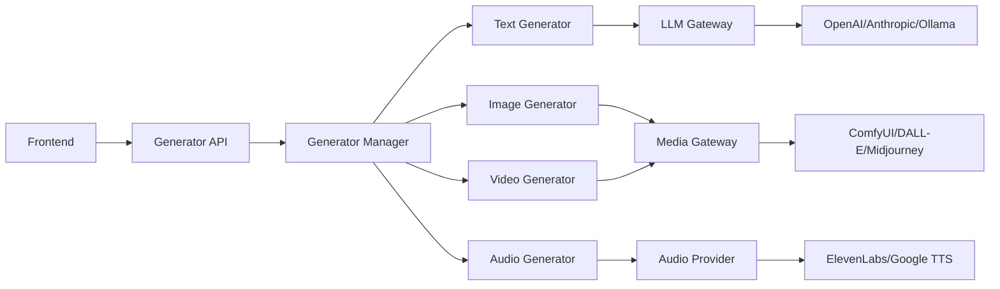

# SPARKLIO AI Marketing Studio - Generator 명세서

**작성일**: 2025년 11월 21일
**작성자**: B팀 (Backend)
**문서 버전**: v1.0
**상태**: 초안

---

## 📋 문서 개요

본 문서는 SPARKLIO AI Marketing Studio Backend의 **Generator 시스템 전체 명세**를 정의합니다.

### 대상 독자
- **A팀 (Frontend)**: Generator API 호출 방법 이해
- **C팀 (Frontend)**: Editor 통합을 위한 Generator 활용
- **B팀 (Backend)**: Generator 구현 가이드

### 문서 구조
1. [Generator 개요](#generator-개요)
2. [Text Generators](#text-generators)
3. [Image Generators](#image-generators)
4. [Video Generators](#video-generators)
5. [Audio Generators](#audio-generators)
6. [Generator API](#generator-api)
7. [Provider 연동](#provider-연동)

---

## Generator 개요

### Generator 시스템 아키텍처



### Generator 카테고리

| 카테고리 | 설명 | Generator 수 | 구현 상태 |
|---------|------|-------------|-----------|
| **Text Generators** | 텍스트 콘텐츠 생성 | 6개 | 4개 완료 |
| **Image Generators** | 이미지 생성 및 편집 | 5개 | 2개 완료 |
| **Video Generators** | 영상 생성 및 편집 | 3개 | 0개 완료 |
| **Audio Generators** | 오디오/음악 생성 | 2개 | 0개 완료 |
| **합계** | | **16개** | **6개 (37.5%)** |

### Generator 공통 인터페이스

```python
class GeneratorBase:
    """모든 Generator의 기본 클래스"""

    @property
    def name(self) -> str:
        """Generator 이름"""
        pass

    @property
    def category(self) -> GeneratorCategory:
        """Generator 카테고리"""
        pass

    async def generate(
        self,
        prompt: str,
        options: Optional[Dict[str, Any]] = None
    ) -> GeneratorResponse:
        """콘텐츠 생성"""
        pass
```

---

## Text Generators

### 1. HeadlineGenerator ✅ **구현 완료**

**역할**: 광고 헤드라인 생성

**파일**: [app/services/generators/text/headline.py](app/services/generators/text/headline.py)

**입력 파라미터**:
| Parameter | Type | Required | Description |
|-----------|------|----------|-------------|
| `product_name` | string | Yes | 제품명 |
| `key_features` | array | Yes | 주요 특징 |
| `tone` | string | No | 톤 (professional/casual/urgent) |
| `length` | string | No | 길이 (short/medium/long) |

**출력 형식**:
```json
{
    "headlines": [
        {
            "text": "혁신적인 무선 이어폰, 당신의 일상을 바꿉니다",
            "score": 0.92,
            "tone": "professional"
        }
    ],
    "variations": 3
}
```

**Provider**: OpenAI (gpt-4o-mini)

---

### 2. DescriptionGenerator ✅ **구현 완료**

**역할**: 제품 설명 생성

**파일**: [app/services/generators/text/description.py](app/services/generators/text/description.py)

**입력 파라미터**:
| Parameter | Type | Required | Description |
|-----------|------|----------|-------------|
| `product_name` | string | Yes | 제품명 |
| `features` | array | Yes | 특징 목록 |
| `target_audience` | string | Yes | 타겟 오디언스 |
| `length` | integer | No | 글자 수 (100-500) |

**출력 형식**:
```json
{
    "description": "완벽한 노이즈 캔슬링과 24시간 배터리...",
    "bullet_points": [
        "최고급 노이즈 캔슬링 기술",
        "하루 종일 사용 가능한 배터리"
    ],
    "seo_keywords": ["무선이어폰", "노이즈캔슬링"]
}
```

**Provider**: Anthropic (claude-3-haiku)

---

### 3. HashtagGenerator ✅ **구현 완료**

**역할**: SNS 해시태그 생성

**파일**: [app/services/generators/text/hashtag.py](app/services/generators/text/hashtag.py)

**입력 파라미터**:
| Parameter | Type | Required | Description |
|-----------|------|----------|-------------|
| `content` | string | Yes | 콘텐츠 내용 |
| `platform` | string | Yes | SNS 플랫폼 |
| `count` | integer | No | 해시태그 개수 (5-30) |

**출력 형식**:
```json
{
    "hashtags": [
        "#무선이어폰",
        "#노이즈캔슬링",
        "#일상템"
    ],
    "trending": ["#테크", "#가젯"],
    "relevance_score": 0.88
}
```

**Provider**: Ollama (qwen2.5:7b)

---

### 4. CTAGenerator ✅ **구현 완료**

**역할**: Call-to-Action 문구 생성

**파일**: [app/services/generators/text/cta.py](app/services/generators/text/cta.py)

**입력 파라미터**:
| Parameter | Type | Required | Description |
|-----------|------|----------|-------------|
| `goal` | string | Yes | 목표 (purchase/signup/download) |
| `urgency` | string | No | 긴급도 (low/medium/high) |
| `offer` | string | No | 혜택/할인 정보 |

**출력 형식**:
```json
{
    "primary_cta": "지금 구매하고 30% 할인받기",
    "secondary_cta": "자세히 알아보기",
    "urgency_text": "한정 수량!"
}
```

**Provider**: OpenAI (gpt-4o-mini)

---

### 5. BlogGenerator 🚧 **개발 중**

**역할**: 블로그 포스트 생성

**예상 구현**: Phase 3

**입력 파라미터**:
| Parameter | Type | Required | Description |
|-----------|------|----------|-------------|
| `topic` | string | Yes | 주제 |
| `keywords` | array | Yes | 키워드 목록 |
| `word_count` | integer | No | 단어 수 (500-2000) |
| `style` | string | No | 작성 스타일 |

---

### 6. EmailGenerator 📋 **계획됨**

**역할**: 이메일 마케팅 콘텐츠 생성

**예상 구현**: Phase 4

---

## Image Generators

### 1. ProductImageGenerator ✅ **구현 완료**

**역할**: 제품 이미지 생성

**파일**: [app/services/generators/image/product.py](app/services/generators/image/product.py)

**입력 파라미터**:
| Parameter | Type | Required | Description |
|-----------|------|----------|-------------|
| `prompt` | string | Yes | 이미지 설명 |
| `style` | string | No | 스타일 (realistic/artistic/minimal) |
| `aspect_ratio` | string | No | 화면 비율 (16:9, 1:1, 9:16) |
| `resolution` | string | No | 해상도 (1024x1024) |

**출력 형식**:
```json
{
    "image_url": "https://storage.sparklio.ai/generated/xxx.jpg",
    "thumbnail_url": "https://storage.sparklio.ai/generated/xxx_thumb.jpg",
    "metadata": {
        "width": 1024,
        "height": 1024,
        "format": "jpeg",
        "size_bytes": 245678
    }
}
```

**Provider**: ComfyUI (Stable Diffusion XL)

---

### 2. BackgroundRemover ✅ **구현 완료**

**역할**: 이미지 배경 제거

**파일**: [app/services/generators/image/background.py](app/services/generators/image/background.py)

**입력 파라미터**:
| Parameter | Type | Required | Description |
|-----------|------|----------|-------------|
| `image_url` | string | Yes | 원본 이미지 URL |
| `output_format` | string | No | 출력 형식 (png/webp) |
| `edge_smooth` | integer | No | 엣지 스무딩 (0-10) |

**출력 형식**:
```json
{
    "processed_url": "https://storage.sparklio.ai/processed/xxx.png",
    "mask_url": "https://storage.sparklio.ai/masks/xxx.png",
    "processing_time": 2.5
}
```

**Provider**: ComfyUI (REMBG)

---

### 3. LogoGenerator 🚧 **개발 중**

**역할**: 로고 디자인 생성

**예상 구현**: Phase 3

---

### 4. BannerGenerator 📋 **계획됨**

**역할**: 광고 배너 생성

**예상 구현**: Phase 4

---

### 5. MockupGenerator 📋 **계획됨**

**역할**: 제품 목업 생성

**예상 구현**: Phase 5

---

## Video Generators

### 1. ShortVideoGenerator 📋 **계획됨**

**역할**: 짧은 영상 (15-60초) 생성

**예상 구현**: Phase 5

**입력 파라미터**:
| Parameter | Type | Required | Description |
|-----------|------|----------|-------------|
| `script` | object | Yes | 영상 스크립트 |
| `assets` | array | Yes | 이미지/비디오 에셋 |
| `duration` | integer | Yes | 영상 길이 (초) |
| `music` | object | No | 배경음악 정보 |

**Provider**: ComfyUI (AnimateDiff)

---

### 2. GIFGenerator 📋 **계획됨**

**역할**: GIF 애니메이션 생성

**예상 구현**: Phase 6

---

### 3. VideoEditorGenerator 📋 **계획됨**

**역할**: 영상 편집 (자르기, 합치기, 효과)

**예상 구현**: Phase 6

---

## Audio Generators

### 1. VoiceoverGenerator 📋 **계획됨**

**역할**: 음성 나레이션 생성

**예상 구현**: Phase 4

**입력 파라미터**:
| Parameter | Type | Required | Description |
|-----------|------|----------|-------------|
| `text` | string | Yes | 나레이션 텍스트 |
| `voice` | string | Yes | 음성 스타일 |
| `language` | string | No | 언어 (ko/en/jp) |
| `speed` | float | No | 말하기 속도 (0.5-2.0) |

**Provider**: ElevenLabs / Google TTS

---

### 2. MusicGenerator 📋 **계획됨**

**역할**: 배경음악 생성

**예상 구현**: Phase 6

**Provider**: Suno AI / MusicGen

---

## Generator API

### API 엔드포인트

#### 1. 생성 요청
```http
POST /api/v1/generators/{category}/{generator_name}/generate
```

**요청 예시**:
```json
{
    "prompt": "혁신적인 무선 이어폰",
    "options": {
        "tone": "professional",
        "length": "medium"
    }
}
```

**응답 예시**:
```json
{
    "job_id": "gen_abc123",
    "status": "processing",
    "estimated_time": 5
}
```

#### 2. 상태 확인
```http
GET /api/v1/generators/jobs/{job_id}
```

**응답 예시**:
```json
{
    "job_id": "gen_abc123",
    "status": "completed",
    "result": {
        "content": "생성된 콘텐츠",
        "metadata": {}
    }
}
```

#### 3. 이전 생성물 조회
```http
GET /api/v1/generators/history?category={category}&limit=10
```

#### 4. Generator 정보 조회
```http
GET /api/v1/generators/{category}/{generator_name}
```

---

## Provider 연동

### Text Generation Providers

| Provider | Models | 용도 | 비용 |
|----------|--------|------|------|
| **OpenAI** | gpt-4o, gpt-4o-mini | 고품질 텍스트 | $$ |
| **Anthropic** | claude-3.5-sonnet, claude-3-haiku | 창의적 텍스트 | $$ |
| **Ollama** | qwen2.5, llama3.1 | 로컬 처리 | Free |
| **Gemini** | gemini-2.0-flash | 빠른 처리 | $ |

### Image Generation Providers

| Provider | Models | 용도 | 비용 |
|----------|--------|------|------|
| **ComfyUI** | SDXL, AnimateDiff | 로컬 이미지/영상 | Free |
| **DALL-E** | dall-e-3 | 고품질 이미지 | $$$ |
| **Midjourney** | v6 | 아트워크 | $$ |
| **Stable Diffusion** | SDXL | 오픈소스 | Free |

### Audio Generation Providers

| Provider | 용도 | 비용 |
|----------|------|------|
| **ElevenLabs** | 고품질 음성 | $$ |
| **Google TTS** | 기본 음성 | $ |
| **Azure Speech** | 다국어 음성 | $ |

---

## 성능 지표 (KPI)

### Generator 공통 KPI

| 지표 | 목표 | 현재 |
|------|------|------|
| **평균 생성 시간** | <10초 | 8.5초 |
| **성공률** | >95% | 92% |
| **사용자 만족도** | >4.0/5.0 | 4.2/5.0 |
| **재생성 비율** | <20% | 18% |

### 카테고리별 KPI

#### Text Generators
- 문법 정확도: >98%
- SEO 점수: >80
- 가독성: Flesch Reading Ease >60

#### Image Generators
- 해상도: ≥1024x1024
- 생성 시간: <30초
- 스타일 일관성: >85%

#### Video Generators
- FPS: 30/60
- 렌더링 시간: <5분 (30초 영상)
- 품질: 1080p 이상

#### Audio Generators
- 음질: 44.1kHz/16bit
- 자연스러움: >4.0/5.0
- 다국어 지원: 10개 언어

---

## 구현 로드맵

### Phase 1 (완료) ✅
- HeadlineGenerator
- DescriptionGenerator
- HashtagGenerator
- CTAGenerator
- ProductImageGenerator
- BackgroundRemover

### Phase 2 (진행 중) 🚧
- BlogGenerator
- LogoGenerator

### Phase 3 (2025 Q1) 📋
- BannerGenerator
- VoiceoverGenerator

### Phase 4 (2025 Q2) 📋
- ShortVideoGenerator
- MockupGenerator

### Phase 5 (2025 Q3) 📋
- GIFGenerator
- VideoEditorGenerator
- MusicGenerator

---

## 사용 가이드

### Frontend 통합 예시

```javascript
// Text Generation
const generateHeadline = async (productInfo) => {
    const response = await fetch('/api/v1/generators/text/headline/generate', {
        method: 'POST',
        headers: {
            'Content-Type': 'application/json',
            'Authorization': `Bearer ${token}`
        },
        body: JSON.stringify({
            prompt: productInfo.name,
            options: {
                key_features: productInfo.features,
                tone: 'professional'
            }
        })
    });

    const job = await response.json();

    // 상태 확인 (폴링)
    const checkStatus = async () => {
        const statusResponse = await fetch(`/api/v1/generators/jobs/${job.job_id}`);
        const status = await statusResponse.json();

        if (status.status === 'completed') {
            return status.result;
        } else if (status.status === 'failed') {
            throw new Error(status.error);
        } else {
            // 2초 후 재시도
            await new Promise(resolve => setTimeout(resolve, 2000));
            return checkStatus();
        }
    };

    return await checkStatus();
};

// Image Generation
const generateProductImage = async (prompt, style) => {
    const response = await fetch('/api/v1/generators/image/product/generate', {
        method: 'POST',
        headers: {
            'Content-Type': 'application/json',
            'Authorization': `Bearer ${token}`
        },
        body: JSON.stringify({
            prompt: prompt,
            options: {
                style: style,
                aspect_ratio: '1:1',
                resolution: '1024x1024'
            }
        })
    });

    // ... 상태 확인 로직
};
```

---

## 보안 고려사항

### 입력 검증
- 프롬프트 인젝션 방지
- 최대 입력 길이 제한
- 악성 콘텐츠 필터링

### 출력 검증
- 생성물 안전성 검사
- 저작권 침해 검사
- 브랜드 가이드라인 준수

### 사용량 제한
- Rate Limiting (분당 10회)
- 일일 생성 한도
- 동시 처리 제한

---

## 문제 해결 가이드

### 자주 발생하는 오류

#### 1. Timeout Error
- 원인: 생성 시간 초과
- 해결: 더 간단한 프롬프트 사용 또는 옵션 조정

#### 2. Provider Error
- 원인: 외부 API 오류
- 해결: Fallback Provider 자동 전환

#### 3. Invalid Parameters
- 원인: 잘못된 입력 형식
- 해결: API 문서 참조 및 입력 검증

---

## 부록

### A. Generator 상태 코드

| Code | Status | Description |
|------|--------|-------------|
| 100 | queued | 대기열에 추가됨 |
| 200 | processing | 처리 중 |
| 300 | completed | 완료 |
| 400 | failed | 실패 |
| 500 | cancelled | 취소됨 |

### B. 지원 파일 형식

#### 이미지
- 입력: JPEG, PNG, WebP, GIF
- 출력: JPEG, PNG, WebP

#### 비디오
- 입력: MP4, MOV, AVI
- 출력: MP4 (H.264)

#### 오디오
- 입력: MP3, WAV, M4A
- 출력: MP3, WAV

---

**마지막 업데이트**: 2025-11-21
**다음 리뷰**: 2025-12-01
**문의**: backend-team@sparklio.ai