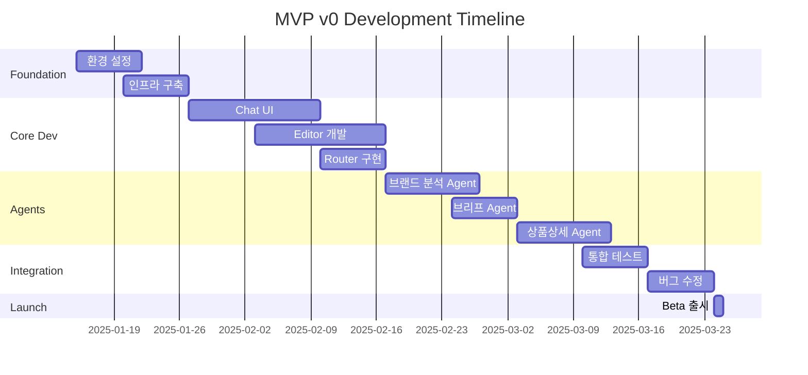

# MVP v0 Scope Plan

> **Version**: 1.1
> **Date**: 2025-11-13 (목요일 오후 5:59)
> **Status**: Final
> **Owner**: Product/Engineering

---

## 1. Executive Summary

Sparklio.ai MVP v0는 **90일 내 출시**를 목표로 하며, 핵심 워크플로우(브랜드 분석 → 브리프 → 콘텐츠 생성 → 발행)를 완성하여 **초기 시장 검증**을 수행합니다.

### 1.1 MVP 목표
- **핵심 가치 증명**: AI 기반 End-to-End 마케팅 자동화
- **시장 피드백 수집**: 1인 브랜드/소규모 팀 대상
- **기술 검증**: Multi-Agent 시스템 안정성
- **수익 모델 테스트**: 크레딧 기반 과금

### 1.2 타임라인
```
Week 1-2:   환경 설정, 인프라 구축
Week 3-6:   Core 모듈 개발 (Chat, Editor, Router)
Week 7-10:  Agent 시스템 구현
Week 11-12: 통합 테스트, 버그 수정
Week 13:    Beta 출시
```

---

## 2. MVP v0 기능 범위

### 2.1 포함 모듈 (In-Scope)

| 모듈 | 구현 수준 | 주요 기능 | 우선순위 |
|------|-----------|----------|----------|
| **브랜드 분석** | 80% | 로고/웹사이트 분석, Brand Kit 생성 | P0 |
| **마케팅 브리프** | 100% | 챗 기반 브리프 생성, 템플릿 제공 | P0 |
| **상품상세 생성** | 90% | 이커머스 최적화 상세페이지 | P0 |
| **블로그(WP)** | 70% | 기본 포스트 생성/발행 | P1 |
| **발행 관리** | 60% | SNS 기본 발행, 파일 Export | P1 |
| **Smart LLM Router** | 100% | 5가지 프리셋, 자동 모델 선택 | P0 |
| **Cost Alert System** | 100% | 비용 경보, 승인 플로우 | P1 |
| **Review Buffer** | 90% | AI 초안 → 사용자 수정 → 승인 | P0 |
| **공통 기반** | 100% | Chat UI, Editor, Router, RAG | P0 |

### 2.2 제외 모듈 (Out-of-Scope)

| 모듈 | 제외 사유 | 목표 버전 |
|------|-----------|-----------|
| **영상 생성** | 리소스 집약적, 기술 복잡도 | v1.1 |
| **PPC Ads** | API 인증/정책 검증 필요 | v1.1 |
| **고급 템플릿** | 사용 패턴 데이터 부족 | v1.2 |
| **팀 협업** | MVP 단일 사용자 집중 | v1.2 |
| **트렌드 분석** | 외부 데이터 소스 계약 | v1.1 |

### 2.3 기능별 상세 요구사항

#### 2.3.0 Smart LLM Router & Cost Alert System

```yaml
Smart LLM Router:
  프리셋 모드:
    - draft_fast: 빠른 초안 (Gemini Flash, Pi, Mistral)
    - balanced: 균형 (GPT-4o, Claude Sonnet, Gemini Pro)
    - high_fidelity: 최고 품질 (GPT-5, GPT-4.1, Claude Sonnet)
    - privacy_first: 프라이버시 (Llama 70B, Qwen2 14B)
    - cost_optimized: 비용 최적화 (Pi, Gemini Flash, Llama 8B)

  에이전트별 자동 매핑:
    - StrategistAgent: high_fidelity 모드
    - CopywriterAgent: balanced 모드
    - TrendCollectorAgent: draft_fast 모드

  성능:
    - 모델 선택 시간: < 50ms
    - 폴백 처리: 자동 2차 모델 선택

Cost Alert System:
  경보 레벨:
    - Warning: $1 이상 (알림만)
    - Approval: $5 이상 (사용자 승인 필요)
    - Critical: $20 이상 (강제 확인)

  사용자 플로우:
    1. 비용 예상치 계산
    2. 경보 레벨 확인
    3. 사용자 승인 요청 (Approval 이상)
    4. 승인 후 작업 실행
    5. 실제 비용 추적 및 알림
```

#### 2.3.1 브랜드 분석 자동화
```yaml
입력:
  - 로고 이미지 (PNG/JPG/SVG)
  - 웹사이트 URL
  - 브랜드 가이드 PDF (선택)

처리:
  - 색상 추출: Dominant/Secondary/Accent
  - 폰트 감지: Heading/Body
  - 톤 분석: Professional/Casual/Creative
  - 키워드 추출: Top 10 brand terms

출력:
  - brand_kit.json
  - 시각화 대시보드

성능:
  - 처리시간: < 30초
  - 정확도: 색상 95%, 폰트 80%
```

#### 2.3.2 마케팅 브리프 (Review Buffer 패턴)

```yaml
챗 플로우:
  1. 목적 선택 (신제품/캠페인/브랜딩)
  2. 타겟 정의 (연령/성별/관심사)
  3. 채널 선택 (SNS/블로그/이메일)
  4. 예산/기간 설정
  5. 톤&매너 확인

Review Buffer 패턴 적용:
  Phase 1 - AI 초안:
    - StrategistAgent가 브리프 초안 생성
    - Smart Router: high_fidelity 모드 사용
    - 사용자에게 초안 제시

  Phase 2 - 사용자 수정:
    - 초안을 편집 가능한 상태로 제공
    - 실시간 AI 제안 (옵션)
    - 변경 이력 추적

  Phase 3 - 승인 및 확정:
    - 사용자가 [확정] 버튼 클릭
    - 브리프 버전 저장
    - 다음 단계(콘텐츠 생성)로 진행

템플릿:
  - 신제품 런칭
  - 시즌 프로모션
  - 브랜드 인지도
  - 리브랜딩

검증:
  - 필수 필드 완성도 100%
  - 브랜드 톤 일치율 > 85%
  - 사용자 승인 완료
```

#### 2.3.3 상품상세 생성 (Multi-Agent 협업)

```yaml
구성요소:
  - 헤드라인 (3 variations)
  - 핵심 가치 제안 (USP)
  - 특징/장점 (Features/Benefits)
  - 스펙 테이블
  - 사용 시나리오
  - FAQ (5-7개)
  - CTA 버튼

Multi-Agent 워크플로우:
  1. StrategistAgent:
     - 제품 포지셔닝 분석
     - 타겟 고객 정의
     - 메시지 전략 수립

  2. CopywriterAgent:
     - 헤드라인 3가지 생성
     - 본문 카피 작성
     - CTA 문구 최적화

  3. SEOAgent:
     - 키워드 추출 및 배치
     - 메타 태그 생성
     - 구조화 데이터 추가

  4. ReviewerAgent:
     - 브랜드 일관성 검증
     - 법적 리스크 체크
     - 최종 품질 확인

Review Buffer 적용:
  - 각 에이전트 결과물을 단계별로 사용자 확인
  - 실시간 수정 가능
  - 최종 승인 후 발행 준비

SEO 최적화:
  - 메타 태그 자동 생성
  - 키워드 밀도 2-3%
  - 이미지 alt 텍스트
  - 구조화 데이터 (Schema.org)

포맷:
  - HTML/Markdown
  - 반응형 레이아웃
  - 모바일 최적화
```

---

## 3. 기술 요구사항

### 3.0 Multi-Agent 시스템

#### 3.0.1 에이전트 목록 (MVP v0 범위)

**Creation Agents (콘텐츠 생성):**
1. **StrategistAgent**: 마케팅 전략, 포지셔닝 분석
2. **CopywriterAgent**: 카피라이팅, 헤드라인 생성
3. **VisionAgent**: 이미지 생성 프롬프트, 비주얼 가이드
4. **TemplateAgent**: 템플릿 선택 및 커스터마이징
5. **SEOAgent**: 키워드 최적화, 메타 태그 생성

**Intelligence Agents (데이터 처리):**
6. **BrandAnalyzerAgent**: 브랜드 분석, Brand Kit 생성
7. **RAGAgent**: 브랜드 문서 검색 및 참조
8. **ReviewerAgent**: 품질 검토, 브랜드 일관성 검증
9. **EmbedderAgent**: 벡터 임베딩, 유사도 검색
10. **DataCleanerAgent**: 데이터 정제 및 전처리

**System Agents (시스템 관리):**
11. **PMAgent**: 작업 분배, 워크플로우 조율
12. **BudgetAgent**: 비용 추적, 예산 관리
13. **RouterAgent**: LLM 모델 선택 및 라우팅

#### 3.0.2 A2A (Agent-to-Agent) 통신

```python
# PresentationWorkflow 예시
class PresentationWorkflow:
    async def generate_product_page(self, brief: Brief) -> Content:
        # Step 1: PMAgent가 작업 분배
        tasks = await self.pm_agent.plan_workflow(brief)

        # Step 2: StrategistAgent 실행
        strategy = await self.strategist.analyze(brief)

        # Step 3: RAGAgent로 브랜드 문서 검색
        brand_context = await self.rag_agent.search(strategy.keywords)

        # Step 4: CopywriterAgent 실행 (strategy + brand_context)
        copy = await self.copywriter.write(strategy, brand_context)

        # Step 5: ReviewerAgent 검토
        review = await self.reviewer.check(copy, brand_kit)

        # Step 6: 사용자에게 초안 제시 (Review Buffer)
        return ReviewBuffer(draft=copy, review=review, editable=True)
```

---

## 4. 성능 및 보안 요구사항

### 4.1 성능 기준

| 메트릭 | 목표 | 측정 방법 |
|--------|------|-----------|
| **API 응답시간** | P50 < 1s, P90 < 2s | APM 모니터링 |
| **초안 생성** | < 3분 | E2E 테스트 |
| **동시 사용자** | 100명 | 부하 테스트 |
| **가용성** | 99.5% | Uptime 모니터링 |
| **에러율** | < 1% | Error tracking |

### 3.2 인프라 요구사항

#### 3.2.1 멀티노드 하이브리드 인프라 (3-Node Setup)

```text
┌────────────────────────┐     ┌────────────────────────┐     ┌────────────────────────┐
│  🖥 Desktop (주말)      │────│  💻 Laptop (평일)       │────│  🍎 Mac mini M2 (24/7)  │
│  RTX 4070 SUPER        │     │  RTX 4060 Laptop       │     │  M2 + Neural Engine     │
│  • 이미지/영상 추론     │     │  • 개발·시연·프론트     │     │  • API Server          │
│  • 로컬 LLM 7B~70B    │     │  • 테스트 환경          │     │  • DB/Redis            │
│  • Stable Diffusion    │     │  • 경량 추론            │     │  • Worker/Scheduler    │
│  • LoRA 학습          │     │  • 로컬 개발 서버       │     │  • MinIO (Media)       │
└────────────────────────┘     └────────────────────────┘     └────────────────────────┘
                     Tailscale VPN + MinIO (Media Sync) + Git (Code Sync)
```

**노드별 역할:**

- **Mac mini M2 (24/7 운영)**:
  - FastAPI 서버, PostgreSQL + pgvector, Redis, MinIO
  - Celery Worker (경량 작업), APScheduler
  - 트렌드 수집, 브랜드 학습 등 백그라운드 작업

- **Desktop RTX 4070 SUPER (주말 운영)**:
  - 고성능 로컬 LLM 추론 (Llama 3.1 70B, Qwen2 14B)
  - Stable Diffusion XL + LoRA 이미지 생성
  - 영상 생성 추론 (향후 확장)

- **Laptop RTX 4060 (평일 개발)**:
  - 개발 환경, 프론트엔드 개발 서버
  - 경량 LLM 추론 (Llama 8B, Mistral 7B)
  - 테스트 및 시연 환경

#### 3.2.2 AI 모델 카탈로그

| 모델 | 프로바이더 | 타입 | 비용/1K | 지연시간 | 품질 | 용도 |
|------|-----------|------|---------|---------|------|------|
| **GPT-5** | OpenAI | Cloud | $0.015 | 3-6s | ⭐⭐⭐⭐⭐ | 최고 난이도 전략·분석 |
| **GPT-4.1** | OpenAI | Cloud | $0.012 | 2-5s | ⭐⭐⭐⭐⭐ | 복잡한 추론 |
| **GPT-4o** | OpenAI | Cloud | $0.0025 | 1-2s | ⭐⭐⭐⭐ | 범용 콘텐츠 생성 |
| **Claude 3.5 Sonnet** | Anthropic | Cloud | $0.003 | 2-4s | ⭐⭐⭐⭐⭐ | 장문 카피라이팅 |
| **Claude 3.5 Haiku** | Anthropic | Cloud | $0.0008 | <1s | ⭐⭐⭐ | 빠른 초안 |
| **Gemini 2.5 Pro** | Google | Cloud | $0.00125 | 2-3s | ⭐⭐⭐⭐ | 멀티모달 분석 |
| **Gemini 2.5 Flash** | Google | Cloud | $0.000075 | <1s | ⭐⭐⭐ | 실시간 응답 |
| **Pi** | Inflection | Cloud | $0.0002 | <1s | ⭐⭐⭐ | 가벼운 어시스트 |
| **Llama 3.1 70B** | Meta | Local | Free | 3-5s | ⭐⭐⭐⭐ | 프라이버시 중요 작업 |
| **Llama 3.1 8B** | Meta | Local | Free | <1s | ⭐⭐⭐ | 경량 추론 |
| **Qwen2 14B** | Alibaba | Local | Free | 1-2s | ⭐⭐⭐ | 다국어 지원 |
| **Mistral 7B** | Mistral | Local | Local | <1s | ⭐⭐⭐ | 빠른 경량 작업 |

#### 3.2.3 Docker Compose 기반 배포

- 모든 서비스 컨테이너화 (FastAPI, Celery, PostgreSQL, Redis, MinIO)
- 환경별 설정 파일 관리 (development, staging, production)
- NodeAwareRouter를 통한 노드별 작업 분배

#### 3.2.4 모니터링 및 로깅

- Prometheus + Grafana: 시스템 메트릭 모니터링
- 노드별 상태 체크 (health check, GPU 사용률, 모델 로드 상태)
- 구조화된 로깅 (JSON 형식, 로그 레벨 관리)

### 3.3 보안 요구사항

- **인증**: JWT + Refresh Token
- **권한**: RBAC (Role-Based Access Control)
- **암호화**: TLS 1.3, AES-256
- **감사**: 모든 API 호출 로깅
- **PII**: 개인정보 마스킹/암호화

### 3.4 브랜드 학습 엔진 (Brand Learning Engine)

```yaml
Self-Learning Loop (4단계):
  1. 수집 (Collect):
     - 사용자가 수정한 콘텐츠
     - 승인/거부 패턴
     - 선호 스타일 데이터

  2. 학습 (Learn):
     - 벡터 임베딩으로 패턴 분석
     - 브랜드 선호도 모델 업데이트
     - 에이전트별 가중치 조정

  3. 적용 (Apply):
     - 다음 콘텐츠 생성 시 학습 데이터 반영
     - RAGAgent를 통한 브랜드 문서 참조
     - 브랜드 일관성 점수 향상

  4. 검증 (Validate):
     - ReviewerAgent가 브랜드 일관성 체크
     - 사용자 피드백 수집
     - 학습 효과 측정 (일관성 점수 변화)

MVP v0 구현 범위:
  - Phase 1, 2 (수집, 학습) 구현
  - Phase 3, 4 (적용, 검증) 기본 구현
  - 고급 학습 알고리즘은 v1.1 이후
```

---

## 5. 품질 기준 (Acceptance Criteria)

### 5.1 기능별 AC

#### 브랜드 분석
- [ ] 10개 테스트 브랜드 90% 정확도
- [ ] 색상 추출 오차 < 5% (Delta E)
- [ ] 처리 실패율 < 2%

#### 마케팅 브리프
- [ ] 5분 내 브리프 완성
- [ ] 템플릿 커버리지 80%
- [ ] 사용자 만족도 > 4.0/5.0

#### 상품상세
- [ ] SEO 점수 > 85 (Lighthouse)
- [ ] 모바일 반응성 100%
- [ ] 로딩 속도 < 2초

#### 발행
- [ ] WordPress 발행 성공률 > 98%
- [ ] 파일 Export 무손실
- [ ] 예약 발행 정확도 100%

### 5.2 비기능 요구사항

- **사용성**: 온보딩 5분 내 완료
- **접근성**: WCAG 2.1 Level AA
- **브라우저**: Chrome, Safari, Edge 지원
- **모바일**: 반응형 웹 (태블릿 포함)

---

## 6. 출시 전략

### 6.1 Beta 테스트 계획

```yaml
대상:
  - Closed Beta: 20명 (내부+친구)
  - Open Beta: 100명 (신청자)

기간:
  - Closed: 2주
  - Open: 4주

피드백 수집:
  - 주간 설문조사
  - 사용 행동 분석
  - 1:1 인터뷰 (10명)

인센티브:
  - 무료 크레딧 50,000
  - Early Bird 50% 할인
  - 피드백 제공자 추가 보너스
```

### 6.2 Go-to-Market

- **타겟**: 1인 창업자, 소상공인, 프리랜서 마케터
- **포지셔닝**: "ChatGPT for Marketing Design"
- **가격**: Freemium (월 10회 무료 → Pro $29/월)
- **채널**: ProductHunt, Reddit, Twitter, 네이버 카페

### 6.3 성공 지표 (KPI)

| 지표 | Week 1 | Month 1 | Month 3 |
|------|--------|---------|---------|
| **가입자** | 100 | 500 | 2,000 |
| **MAU** | 50 | 200 | 800 |
| **유료 전환** | 5% | 10% | 15% |
| **Retention** | 60% | 40% | 35% |
| **NPS** | 30 | 40 | 50 |

---

## 7. 리스크 관리

### 7.1 기술적 리스크

| 리스크 | 영향도 | 발생확률 | 대응 방안 |
|--------|--------|----------|-----------|
| **LLM API 장애** | 높음 | 중간 | 다중 프로바이더, 로컬 폴백 |
| **GPU 메모리 부족** | 높음 | 낮음 | 모델 양자화, 배치 크기 조정 |
| **DB 성능 저하** | 중간 | 중간 | 인덱싱 최적화, 캐싱 강화 |
| **비용 초과** | 높음 | 중간 | 사용량 제한, 실시간 모니터링 |

### 7.2 사업적 리스크

- **경쟁사 출시**: 차별화 기능 강화 (Review Buffer)
- **규제 변화**: GDPR/AI Act 컴플라이언스 준비
- **시장 반응 미온**: 피봇 가능한 아키텍처 유지

---

## 8. 팀 구성 및 역할

### 8.1 개발팀 구조

```
Product Owner (1)
  ├── Backend Lead (1)
  │   └── Backend Dev (2)
  ├── Frontend Lead (1)
  │   └── Frontend Dev (1)
  ├── AI/ML Engineer (2)
  ├── DevOps (1)
  └── QA Engineer (1)
```

### 8.2 주요 책임 (RACI)

| 영역 | Responsible | Accountable | Consulted | Informed |
|------|------------|-------------|-----------|----------|
| **Product** | PO | CEO | Users | Team |
| **Backend** | Backend Lead | CTO | DevOps | PO |
| **Frontend** | Frontend Lead | CTO | Designer | PO |
| **AI/ML** | AI Engineer | CTO | Researcher | Team |
| **인프라** | DevOps | CTO | Backend | Team |
| **품질** | QA | PO | Dev Team | CEO |

---

## 9. 일정 및 마일스톤

### 9.1 상세 일정표



### 9.2 체크포인트

- **CP1 (Week 2)**: 인프라 준비 완료
- **CP2 (Week 6)**: Core 모듈 동작
- **CP3 (Week 10)**: Agent 통합 완료
- **CP4 (Week 12)**: QA 통과
- **CP5 (Week 13)**: Beta 출시

---

## 10. Definition of Done

### 10.1 기능 완료 기준

- [ ] 코드 리뷰 완료 (2명 이상 승인)
- [ ] 단위 테스트 커버리지 > 80%
- [ ] 통합 테스트 통과
- [ ] 문서화 완료 (API, 사용자 가이드)
- [ ] 성능 기준 충족
- [ ] 보안 검토 통과

### 10.2 출시 준비 체크리스트

- [ ] Production 환경 배포
- [ ] 모니터링 대시보드 구성
- [ ] 백업/복구 테스트
- [ ] 부하 테스트 통과
- [ ] 사용자 온보딩 플로우
- [ ] 결제 시스템 연동
- [ ] 법적 문서 준비 (약관, 개인정보)

---

## 11. 부록

### 11.1 용어 정의

- **MVP**: Minimum Viable Product
- **AC**: Acceptance Criteria
- **DoD**: Definition of Done
- **P0/P1/P2**: Priority levels
- **A2A**: Agent-to-Agent (에이전트 간 통신)
- **RAG**: Retrieval-Augmented Generation
- **Review Buffer**: AI 초안 → 사용자 수정 → 승인 패턴
- **Smart Router**: 최적 LLM 모델 자동 선택 시스템

### 11.2 참조 문서

**Phase 0 문서 통합 맵:**

```text
MVP_v0_SCOPE_PLAN.md (본 문서)
├── 90일 출시 계획 및 범위 정의
├── 13개 에이전트 목록 (MVP 범위)
└── 기술 요구사항 참조
    │
    ├─→ TECH_DECISION_v1.md
    │   ├── 기술 스택 상세 (FastAPI, Next.js, PostgreSQL)
    │   ├── Multi-Node Infrastructure (3-Node Setup)
    │   ├── Smart LLM Router 구현
    │   └── Chat-Driven Creation 패턴
    │
    ├─→ LLM_ROUTER_POLICY.md
    │   ├── 5가지 프리셋 모드 (draft_fast, balanced, high_fidelity, privacy_first, cost_optimized)
    │   ├── 에이전트별 최적 모델 매핑 (16개 에이전트)
    │   ├── Cost Alert System (Warning $1, Approval $5, Critical $20)
    │   └── 12개 AI 모델 카탈로그
    │
    ├─→ AGENTS_SPEC.md
    │   ├── 16개 에이전트 상세 스펙
    │   ├── A2A Protocol (Agent-to-Agent 통신)
    │   ├── PresentationWorkflow 예시
    │   └── 에이전트별 입출력 정의
    │
    ├─→ BRAND_LEARNING_ENGINE.md
    │   ├── Self-Learning Loop (4단계: Collect → Learn → Apply → Validate)
    │   ├── 브랜드 일관성 학습 알고리즘
    │   └── Review Buffer 패턴 상세
    │
    └─→ DATA_PIPELINE_PLAN.md
        ├── TrendPipeline (7단계)
        ├── BrandPipeline (벡터 임베딩)
        └── 데이터 파이프라인 아키텍처
```

**외부 문서:**
- [PRD v4 Final](../PRD/Sparklio_V4_PRD_Final.md) - 제품 요구사항 정의
- [Technical Architecture](./TECH_DECISION_v1.md) - 기술 아키텍처
- [Agent Specification](./AGENTS_SPEC.md) - 에이전트 스펙
- [LLM Router Policy](./LLM_ROUTER_POLICY.md) - LLM 라우팅 정책
- [Brand Learning Engine](./BRAND_LEARNING_ENGINE.md) - 브랜드 학습 엔진
- [Data Pipeline Plan](./DATA_PIPELINE_PLAN.md) - 데이터 파이프라인

### 11.3 변경 이력

| 날짜 | 버전 | 변경 내용 | 작성자 |
|------|------|-----------|--------|
| 2025-01-13 | 1.0 | 초기 작성 | Product Team |
| 2025-11-13 (목) | 1.1 | 3-Node Infrastructure, Smart LLM Router, Cost Alert System, Review Buffer, 13개 에이전트, 브랜드 학습 엔진, Phase 0 문서 통합 맵 추가 | Product Team |
