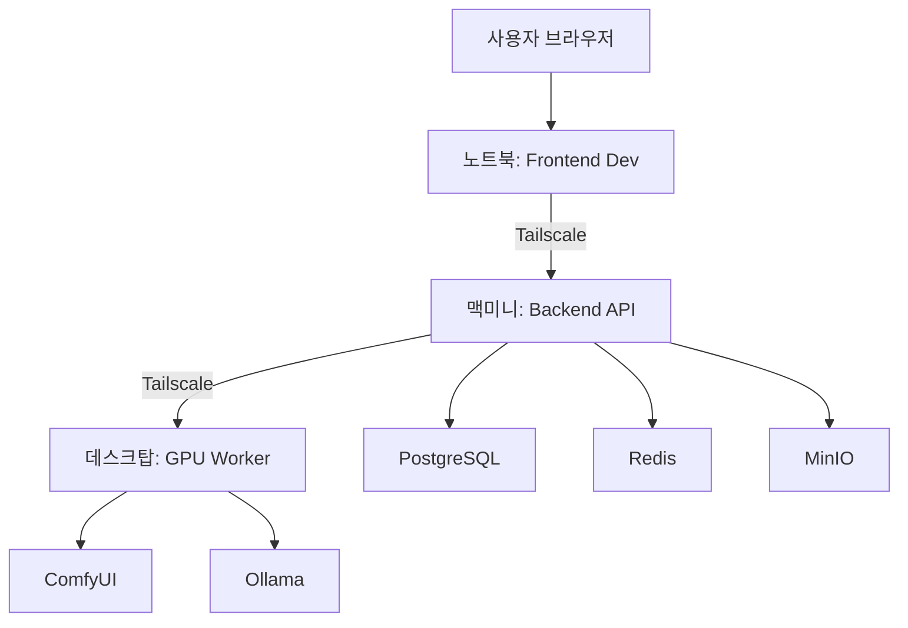

# Sparklio AI Marketing Studio - MVP 종합 계획서

**작성일**: 2025년 11월 21일
**버전**: v1.0
**상태**: 최종 MVP 계획
**작성자**: 통합 팀 (A팀, B팀, C팀)

---

## Executive Summary

Sparklio AI Marketing Studio는 AI 기반 마케팅 콘텐츠 자동 생성 플랫폼입니다. 본 문서는 2025년 11월 21일 기준 프로젝트의 전체 현황과 최종 MVP 런칭을 위한 종합 계획을 담고 있습니다.

### 핵심 지표 (2025-11-21 기준)

| 항목 | 현황 | 목표 |
|------|------|------|
| **전체 진행률** | 68% | 100% (MVP) |
| **Backend Agents** | 11/24 (46%) | 18/24 (75%) |
| **Generators** | 6/16 (38%) | 12/16 (75%) |
| **Frontend 컴포넌트** | 70% | 95% |
| **에디터 통합** | 60% (Polotno 대기) | 90% |
| **배포 준비도** | 40% | 100% |

### 주요 마일스톤

- **Week 1-2** (2025-11-22 ~ 2025-12-05): 에디터 마이그레이션 완료 + 핵심 Agent 구현
- **Week 3-4** (2025-12-06 ~ 2025-12-19): 통합 테스트 + 안정화
- **Week 5** (2025-12-20 ~ 2025-12-26): MVP 런칭 준비 + 최종 QA
- **런칭일**: 2025년 12월 30일 (예정)

---

## 1. 시스템 아키텍처 현황

### 1.1 인프라 구성

#### 맥미니 (Control Tower) - `100.123.51.5`
**역할**: Backend API 서버 + 데이터베이스 + 캐시

**실행 서비스**:
```
- FastAPI Backend (Port 8000, 8001)
- PostgreSQL (Port 5432)
- Redis (Port 6379)
- MinIO Object Storage (Port 9000, 9001)
```

**현황**:
- Docker Compose 구성 완료 (2025-11-21)
- 자동 재시작 정책 설정 완료
- Backend 이미지 빌드 완료

**남은 작업**:
- [ ] API 키 환경변수 설정 (.env.mini)
- [ ] 프로덕션 배포 테스트
- [ ] 헬스체크 모니터링 설정

#### 데스크탑 (GPU Worker) - `100.120.180.42`
**역할**: AI 모델 추론 (이미지/영상 생성)

**실행 서비스**:
```
- Ollama (Docker, Port 11434) - LLM 추론
- ComfyUI (로컬 앱, Port 8188) - 이미지/영상 생성
```

**현황**:
- ComfyUI 로컬 실행 환경 구축 완료
- Ollama Docker 컨테이너 운영 중

**남은 작업**:
- [ ] ComfyUI 워크플로우 템플릿 작성
- [ ] 모델 다운로드 및 최적화
- [ ] GPU 메모리 관리 스크립트

#### 노트북 (Development)
**역할**: Frontend 개발 환경

**실행 서비스**:
```
- Next.js Dev Server (Port 3000)
- VSCode
```

**현황**:
- 개발 환경 구성 완료
- Polotno/LayerHub 에디터 통합 진행 중

### 1.2 기술 스택

#### Frontend
```json
{
  "framework": "Next.js 14.2.18",
  "ui": "React 18.3.1 + TailwindCSS",
  "state": "Zustand 5.0.8",
  "editors": [
    "Polotno 2.32.4 (Primary)",
    "LayerHub Pro 10.2.0 (Secondary)",
    "Konva 9.3.22 (Legacy)"
  ],
  "language": "TypeScript 5"
}
```

#### Backend
```python
{
  "framework": "FastAPI 0.121.2",
  "llm_providers": [
    "OpenAI (GPT-4o, GPT-4o-mini)",
    "Anthropic (Claude 3.5 Sonnet, Claude 3 Opus)",
    "Google Gemini (Gemini 2.5 Flash)",
    "Ollama (Qwen 2.5:7b, Llama 3.1)"
  ],
  "database": "PostgreSQL + pgvector",
  "cache": "Redis 5.0.1",
  "storage": "MinIO 7.2.0",
  "python": "3.11+"
}
```

#### AI/ML
```
- Text Generation: OpenAI, Anthropic, Gemini, Ollama
- Image Generation: ComfyUI (Stable Diffusion XL)
- Vision Analysis: Claude 3 Opus, GPT-4o
- Embedding: OpenAI text-embedding-3-small
```

### 1.3 네트워크 아키텍처



---

## 2. 완료된 기능 (Phase별)

### Phase 0: 기반 시스템 (100% 완료)
**기간**: 2025-11-15 ~ 2025-11-16

#### Backend
- [x] FastAPI 프로젝트 구조 설정
- [x] LLM Gateway 아키텍처 구축
- [x] Provider 추상화 (OpenAI, Anthropic, Gemini, Ollama)
- [x] Redis 선택적 연결 (NO-REDIS 모드 지원)
- [x] Mock Mode 지원

#### Frontend
- [x] Next.js 14 프로젝트 설정
- [x] TailwindCSS + Zustand 설정
- [x] 기본 레이아웃 구성

**산출물**:
- `backend/app/services/llm/gateway.py`
- `backend/app/core/redis_client.py`
- `frontend/store/*`

### Phase 1: P0 Generator (100% 완료)
**기간**: 2025-11-16 ~ 2025-11-17

#### Text Generators (4개)
- [x] HeadlineGenerator - 광고 헤드라인 생성
- [x] DescriptionGenerator - 제품 설명 생성
- [x] HashtagGenerator - SNS 해시태그 생성
- [x] CTAGenerator - Call-to-Action 문구 생성

#### Image Generators (2개)
- [x] ProductImageGenerator - 제품 이미지 생성 (ComfyUI)
- [x] BackgroundRemover - 배경 제거 (REMBG)

**산출물**:
- `backend/app/services/generators/text/*`
- `backend/app/services/generators/image/*`
- `backend/GENERATORS_SPEC.md`

### Phase 2: Creation Agents (70% 완료)
**기간**: 2025-11-17 ~ 2025-11-21

#### 완료된 Agents (7개)
- [x] CopywriterAgent - 텍스트 콘텐츠 생성
- [x] StrategistAgent - 마케팅 전략 수립
- [x] DesignerAgent - 비주얼 콘텐츠 생성
- [x] ReviewerAgent - 콘텐츠 품질 검토
- [x] OptimizerAgent - SEO 및 전환율 최적화
- [x] EditorAgent - 콘텐츠 편집 및 교정
- [x] VisionAnalyzerAgent - 이미지 품질 평가 (Vision API)

#### 진행 중 Agents (1개)
- [x] ScenePlannerAgent - 영상 씬 구성 설계 (구현 완료, 테스트 중)

#### 계획된 Agents (1개)
- [ ] TemplateAgent - 마케팅 템플릿 자동 생성

**산출물**:
- `backend/app/services/agents/*`
- `backend/AGENTS_SPEC.md` (1,597줄)

### Phase 3: Intelligence Agents (40% 완료)
**기간**: 2025-11-21 (오늘 시작)

#### 완료된 Agents (4개)
- [x] TrendCollectorAgent - 마케팅 트렌드 수집
- [x] DataCleanerAgent - 데이터 정제 및 품질 개선
- [x] EmbedderAgent - 텍스트/이미지 임베딩
- [x] RAGAgent - 검색 증강 생성 (RAG)

#### 계획된 Agents (3개)
- [ ] IngestorAgent - 데이터 저장 (PostgreSQL, Redis, S3)
- [ ] PerformanceAnalyzerAgent - SNS/광고 성과 분석
- [ ] SelfLearningAgent - 브랜드 벡터 자동 학습

**산출물**:
- `backend/app/services/agents/trend_collector.py` (700+ 라인)
- `backend/app/services/agents/data_cleaner.py` (650+ 라인)
- `backend/app/services/agents/embedder.py` (550+ 라인)
- `backend/app/services/agents/rag.py` (600+ 라인)

### Phase 4-5: Frontend UI (70% 완료)
**기간**: 2025-11-18 ~ 2025-11-21

#### Spark Chat (90% 완료)
- [x] Chat UI 컴포넌트
- [x] useSparkChat Hook
- [x] LLM Provider 선택 UI
- [x] Mock API 연동
- [ ] 실제 Backend 연동 (대기 중)

#### Meeting AI (80% 완료)
- [x] Meeting UI 레이아웃
- [x] 회의록 분석 UI
- [x] Mock API 연동
- [ ] 실제 Backend 연동 (대기 중)

#### Brand Kit (60% 완료)
- [x] 브랜드 가이드라인 UI
- [ ] CRUD API 연동
- [ ] 브랜드 일관성 검사 통합

**산출물**:
- `frontend/components/spark/*`
- `frontend/components/meeting/*`
- `frontend/hooks/*`

### Phase 6: 에디터 마이그레이션 (60% 완료)
**기간**: 2025-11-20 ~ 2025-11-21

#### 완료 작업
- [x] SparklioDocument v2.0 모델 설계 (40+ Object Roles)
- [x] BaseAdapter 인터페이스 정의
- [x] PolotnoAdapter 기본 구현
- [x] LayerHubAdapter 기본 구현
- [x] PolotnoEditorStub 구현 (API 키 대기 UI)
- [x] LayerHub Mock Editor 구현

#### 진행 중 작업
- [ ] Polotno API 키 확보 (대기 중)
- [ ] AI Command 실제 구현
- [ ] 에디터 ↔ Spark Chat 통합

**산출물**:
- `frontend/lib/sparklio/document.ts`
- `frontend/lib/sparklio/adapters/*`
- `frontend/components/polotno-studio/*`
- `frontend/HANDOVER_REPORT_2025-11-21.md`

### Phase 10: 인프라 구축 (80% 완료)
**기간**: 2025-11-21

#### 완료 작업
- [x] Docker Compose 구성 (맥미니)
- [x] Backend Dockerfile 작성
- [x] 환경변수 템플릿 (.env.mini)
- [x] 자동 재시작 정책 설정
- [x] Tailscale VPN 네트워크 구성

#### 남은 작업
- [ ] 프로덕션 환경변수 설정
- [ ] HTTPS/SSL 인증서 설정
- [ ] 로깅 및 모니터링 구성
- [ ] 백업 스크립트 작성

**산출물**:
- `docker/mac-mini/docker-compose.yml`
- `backend/Dockerfile`
- `docs/A_TEAM_MACMINI_BACKEND_SETUP.md`
- `docs/INFRA_README.md`

---

## 3. 진행 중인 작업 (팀별)

### A팀 (QA & Infrastructure)
**현재 작업**: 맥미니 백엔드 서버 구성 완료

**완료 항목**:
- [x] Docker Compose 백엔드 서비스 추가
- [x] 맥미니 설정 가이드 작성
- [x] 인프라 문서 업데이트

**다음 작업**:
- [ ] API 키 환경변수 설정
- [ ] 프로덕션 배포 테스트
- [ ] Frontend 빌드 및 배포 스크립트 작성
- [ ] E2E 통합 테스트 작성

### B팀 (Backend)
**현재 작업**: Intelligence Agents 구현 (2025-11-21)

**오늘 완료 항목** (2025-11-21):
- [x] VisionAnalyzerAgent 문서화 완료
- [x] ScenePlannerAgent 구현 완료 (700+ 라인)
- [x] TrendCollectorAgent 구현 완료
- [x] DataCleanerAgent 구현 완료
- [x] EmbedderAgent 구현 완료
- [x] RAGAgent 구현 완료
- [x] GENERATORS_SPEC.md 작성 완료
- [x] Mock 인증 모듈 구현

**누적 생산성** (2025-11-21):
- 작성 라인 수: 2,500+ 라인
- 신규 파일: 5개
- 업데이트된 문서: 2개 (AGENTS_SPEC.md, GENERATORS_SPEC.md)

**다음 작업** (우선순위):
1. **P0 (최우선)**:
   - [ ] 현재 변경사항 Git commit & push
   - [ ] TemplateAgent 구현 시작
2. **P1 (중요)**:
   - [ ] Agent Factory 패턴 구현
   - [ ] IngestorAgent 구현
   - [ ] PerformanceAnalyzerAgent 구현
3. **P2 (향후)**:
   - [ ] Generator 테스트 스크립트 작성
   - [ ] Redis 캐싱 레이어 구현

**보류 항목**:
- Sparklio Editor API 관련 작업 (Polotno API 키 미확보)

### C팀 (Frontend)
**현재 작업**: 에디터 마이그레이션 (Polotno 중심)

**오늘 완료 항목** (2025-11-21):
- [x] SparklioDocument v2.0 모델 강화
- [x] 에디터 어댑터 시스템 구축
- [x] PolotnoEditorStub 구현
- [x] LayerHub Mock Editor 구현

**현황**:
- 에디터 선택 화면 작동 (`/studio`)
- LayerHub Mock Editor 완전 작동 (`/studio/layerhub`)
- Polotno Stub UI 표시 (`/studio/polotno`) - API 키 대기 중
- Konva Legacy 참조용 유지 (`/studio/konva`)

**즉시 작업** (Polotno API 키 확보 시):
1. `.env.local` 업데이트
2. Polotno 에디터 테스트
3. AI Command 통합 시작

**단기 작업** (1-2일):
1. AI Command 구현 (자연어 → EditorCommand 변환)
2. 맥미니 백엔드 연동 (문서 저장/불러오기)
3. Spark Chat ↔ Editor 통합

**중기 작업** (3-5일):
1. Meeting AI 통합
2. Brand Kit 관리
3. 템플릿 시스템

---

## 4. 향후 작업 계획 (우선순위별)

### P0 (최우선) - Week 1-2
**목표**: 핵심 기능 완성 + 에디터 통합

#### Backend (B팀)
**날짜**: 2025-11-22 ~ 2025-12-05

1. **Agent 확장** (7일):
   - [ ] TemplateAgent 구현 (2일)
   - [ ] IngestorAgent 구현 (2일)
   - [ ] PerformanceAnalyzerAgent 구현 (2일)
   - [ ] Agent Factory 패턴 구현 (1일)

2. **Generator 확장** (4일):
   - [ ] BlogGenerator 구현 (2일)
   - [ ] LogoGenerator 구현 (2일)

3. **API 안정화** (3일):
   - [ ] 에러 처리 개선
   - [ ] Retry 로직 구현
   - [ ] Rate Limiting 설정

**예상 산출물**:
- 18개 Agents (현재 11개 → +7개)
- 9개 Generators (현재 6개 → +3개)
- 안정적인 API 엔드포인트

#### Frontend (C팀)
**날짜**: 2025-11-22 ~ 2025-12-05

1. **Polotno 에디터 통합** (5일):
   - [ ] API 키 확보 및 설정 (1일)
   - [ ] Polotno 기본 기능 테스트 (2일)
   - [ ] AI Command 구현 (2일)

2. **Backend 연동** (4일):
   - [ ] 맥미니 API 연결 (1일)
   - [ ] 문서 저장/불러오기 (2일)
   - [ ] Spark Chat 통합 (1일)

3. **UI 개선** (5일):
   - [ ] 로딩 상태 표시
   - [ ] 에러 메시지 개선
   - [ ] 반응형 레이아웃 최적화

**예상 산출물**:
- 완전히 작동하는 Polotno 에디터
- Backend API 통합 완료
- Spark Chat ↔ Editor 양방향 통신

#### Infrastructure (A팀)
**날짜**: 2025-11-22 ~ 2025-12-05

1. **프로덕션 환경 설정** (3일):
   - [ ] API 키 설정 (.env.mini)
   - [ ] HTTPS/SSL 인증서 (Let's Encrypt)
   - [ ] 도메인 설정 (sparklio.ai)

2. **배포 자동화** (4일):
   - [ ] Frontend 빌드 스크립트
   - [ ] Backend 배포 스크립트
   - [ ] CI/CD 파이프라인 (GitHub Actions)

3. **모니터링** (3일):
   - [ ] Prometheus + Grafana 설정
   - [ ] 로그 수집 (ELK Stack)
   - [ ] 알림 설정 (Slack 연동)

**예상 산출물**:
- 자동화된 배포 파이프라인
- 실시간 모니터링 대시보드
- 안정적인 프로덕션 환경

### P1 (중요) - Week 3-4
**목표**: 통합 테스트 + 안정화

#### 통합 테스트 (전체 팀)
**날짜**: 2025-12-06 ~ 2025-12-19

1. **기능 테스트** (5일):
   - [ ] Spark Chat 시나리오 테스트
   - [ ] Meeting AI 시나리오 테스트
   - [ ] 에디터 시나리오 테스트
   - [ ] Brand Kit 시나리오 테스트

2. **성능 테스트** (4일):
   - [ ] 부하 테스트 (Locust)
   - [ ] LLM API 응답 시간 측정
   - [ ] 이미지 생성 시간 측정
   - [ ] 병목 지점 분석 및 최적화

3. **보안 테스트** (3일):
   - [ ] API 인증/인가 테스트
   - [ ] 입력 검증 테스트
   - [ ] SQL Injection 방지 확인
   - [ ] XSS 방지 확인

4. **버그 수정** (2일):
   - [ ] 발견된 버그 수정
   - [ ] 회귀 테스트

**예상 산출물**:
- 테스트 보고서
- 성능 벤치마크 결과
- 버그 수정 완료

### P2 (향후) - Week 5
**목표**: MVP 런칭 준비

#### 최종 준비 (전체 팀)
**날짜**: 2025-12-20 ~ 2025-12-26

1. **문서화** (2일):
   - [ ] 사용자 가이드 작성
   - [ ] API 문서 최종 업데이트
   - [ ] 배포 가이드 작성
   - [ ] 트러블슈팅 가이드 작성

2. **최종 QA** (2일):
   - [ ] 전체 기능 재테스트
   - [ ] 브라우저 호환성 테스트
   - [ ] 모바일 반응형 테스트

3. **데모 준비** (1일):
   - [ ] 데모 시나리오 작성
   - [ ] 샘플 데이터 준비
   - [ ] 발표 자료 준비

4. **런칭 체크리스트** (1일):
   - [ ] 프로덕션 환경 최종 점검
   - [ ] 백업 확인
   - [ ] 롤백 계획 수립
   - [ ] 런칭 공지

**예상 산출물**:
- 완성된 사용자 가이드
- MVP 런칭 준비 완료
- 데모 및 발표 자료

---

## 5. 최종 MVP 워크플로우

### 5.1 사용자 시나리오: 제품 마케팅 콘텐츠 생성

#### Step 1: Spark Chat으로 요구사항 입력
```
사용자: "무선 이어폰 X1을 위한 인스타그램 광고 이미지를 만들어줘.
        타겟은 2030 직장인이고, 노이즈 캔슬링과 24시간 배터리가 주요 특징이야."
```

#### Step 2: AI 분석 및 계획 수립
**PMAgent (향후 구현)** 또는 **현재 LLM Gateway**:
- 요청 분석: "인스타그램 광고 이미지 생성"
- 필요한 Agent 식별:
  1. CopywriterAgent (헤드라인, 바디 카피)
  2. DesignerAgent (제품 이미지)
  3. ReviewerAgent (품질 검토)
  4. VisionAnalyzerAgent (이미지 품질 평가)

#### Step 3: Agent 순차 실행
```javascript
// 1. CopywriterAgent - 카피 생성
{
  "headline": "완벽한 몰입, X1과 함께",
  "body": "출퇴근길도, 카페에서도 당신만의 공간",
  "cta": "지금 특가로 만나보세요"
}

// 2. DesignerAgent - 이미지 생성 (ComfyUI)
{
  "image_url": "https://storage.sparklio.ai/gen/img_001.jpg",
  "metadata": { "width": 1080, "height": 1080 }
}

// 3. VisionAnalyzerAgent - 품질 평가
{
  "quality_score": 0.87,
  "improvements": ["배경색을 약간 밝게 조정 권장"]
}

// 4. ReviewerAgent - 최종 검토
{
  "overall_score": 8.5,
  "approved": true
}
```

#### Step 4: Polotno Editor로 전송
- 생성된 요소들이 에디터 캔버스에 자동 배치
- 사용자는 수동으로 미세 조정 가능

#### Step 5: 최종 결과물 저장
- 에디터에서 "저장" 클릭
- SparklioDocument v2.0 형식으로 PostgreSQL에 저장
- 이미지는 MinIO에 저장
- 메타데이터는 Redis 캐싱

### 5.2 핵심 기능 플로우

#### Spark Chat 플로우
```
사용자 입력 (자연어)
  ↓
useSparkChat Hook
  ↓
POST /api/v1/chat/analyze
  ↓
LLMGateway (Provider 선택)
  ↓
Agent 실행 (CopywriterAgent 등)
  ↓
결과 반환 (JSON)
  ↓
ChatInterface 표시
  ↓
"에디터로 전송" 버튼 클릭
  ↓
Polotno Editor 열림
```

#### Meeting AI 플로우
```
회의록 업로드 (TXT/PDF)
  ↓
POST /api/v1/meeting/analyze
  ↓
텍스트 추출 및 분석
  ↓
액션 아이템 추출 (CopywriterAgent)
  ↓
마케팅 액션 생성 (StrategistAgent)
  ↓
결과 표시 (UI)
  ↓
"Spark Chat으로 전송" 클릭
```

#### 에디터 플로우
```
Polotno Editor 열기
  ↓
빈 캔버스 또는 템플릿 선택
  ↓
AI Command 입력 (예: "헤드라인 추가")
  ↓
POST /api/v1/editor/ai_command
  ↓
적절한 Agent 실행
  ↓
에디터 객체 생성 및 배치
  ↓
사용자 수동 조정
  ↓
저장 (SparklioDocument v2.0)
```

---

## 6. 배포 체크리스트

### 6.1 Backend 배포 체크리스트

#### 환경 설정
- [ ] `.env.mini` 파일 작성 및 모든 API 키 설정
  - [ ] OPENAI_API_KEY
  - [ ] ANTHROPIC_API_KEY
  - [ ] GOOGLE_API_KEY
  - [ ] POSTGRES_PASSWORD
  - [ ] REDIS_PASSWORD
  - [ ] MINIO_SECRET_KEY
- [ ] `GENERATOR_MODE=live` 설정
- [ ] `DEBUG=false` 설정

#### 데이터베이스
- [ ] PostgreSQL 마이그레이션 실행 (Alembic)
- [ ] pgvector 확장 설치 확인
- [ ] 초기 데이터 시딩 (템플릿, 샘플 브랜드 등)
- [ ] 인덱스 생성 확인

#### 서비스 실행
- [ ] `docker compose up -d --build` 실행
- [ ] 모든 컨테이너 정상 실행 확인
- [ ] 헬스체크 통과 확인
  ```bash
  curl http://100.123.51.5:8000/health
  curl http://100.123.51.5:8001/api/v1/admin/stats
  ```

#### GPU Worker 설정
- [ ] 데스크탑 ComfyUI 실행 확인
- [ ] Ollama 컨테이너 실행 확인
- [ ] 모델 다운로드 완료 (Qwen 2.5:7b, Llama 3.1)
- [ ] ComfyUI 워크플로우 테스트

#### API 테스트
- [ ] LLM Gateway 테스트 (모든 Provider)
- [ ] Agent API 테스트 (CopywriterAgent 등)
- [ ] Generator API 테스트 (HeadlineGenerator 등)
- [ ] Vision API 테스트 (VisionAnalyzerAgent)
- [ ] 에러 핸들링 확인

### 6.2 Frontend 배포 체크리스트

#### 빌드 설정
- [ ] `.env.production` 파일 작성
  ```env
  NEXT_PUBLIC_API_BASE_URL=https://api.sparklio.ai
  NEXT_PUBLIC_POLOTNO_API_KEY=xxx
  ```
- [ ] `npm run build` 성공 확인
- [ ] 빌드 크기 최적화 (<5MB)

#### 에디터 설정
- [ ] Polotno API 키 유효성 확인
- [ ] LayerHub 라이선스 확인
- [ ] 에디터 로딩 속도 최적화 (<3초)

#### 브라우저 테스트
- [ ] Chrome 최신 버전
- [ ] Firefox 최신 버전
- [ ] Safari (macOS/iOS)
- [ ] Edge 최신 버전
- [ ] 모바일 반응형 (iPhone, Android)

#### 성능 최적화
- [ ] Lighthouse 점수 >90
- [ ] Core Web Vitals 통과
  - [ ] LCP (Largest Contentful Paint) <2.5s
  - [ ] FID (First Input Delay) <100ms
  - [ ] CLS (Cumulative Layout Shift) <0.1
- [ ] 이미지 최적화 (WebP 포맷)
- [ ] 코드 스플리팅 적용

### 6.3 인프라 배포 체크리스트

#### 네트워크
- [ ] Tailscale 연결 안정성 확인
- [ ] 방화벽 포트 허용 (8000, 8001, 3000)
- [ ] DNS 설정 (sparklio.ai → 맥미니 IP)

#### SSL/HTTPS
- [ ] Let's Encrypt 인증서 발급
- [ ] 자동 갱신 설정
- [ ] HTTPS 리다이렉트 설정

#### 모니터링
- [ ] Prometheus 메트릭 수집 확인
- [ ] Grafana 대시보드 설정
- [ ] 알림 규칙 설정 (Slack 연동)
- [ ] 로그 수집 (ELK Stack)

#### 백업
- [ ] PostgreSQL 자동 백업 스크립트
- [ ] MinIO 버킷 백업 설정
- [ ] 복구 테스트 수행

#### 보안
- [ ] API 키 암호화 저장
- [ ] CORS 설정 확인
- [ ] Rate Limiting 설정 (분당 100회)
- [ ] SQL Injection 방지 확인
- [ ] XSS 방지 확인

### 6.4 최종 런칭 체크리스트

#### 1일 전
- [ ] 전체 팀 런칭 회의
- [ ] 배포 시나리오 리허설
- [ ] 롤백 계획 수립
- [ ] 긴급 연락망 공유

#### 런칭일 (D-Day)
- [ ] 오전 10시: 프로덕션 배포
- [ ] 오전 10시 30분: 헬스체크 확인
- [ ] 오전 11시: 전체 기능 테스트
- [ ] 오후 12시: 내부 사용자 베타 테스트
- [ ] 오후 2시: 모니터링 확인
- [ ] 오후 4시: 공식 런칭 발표

#### 런칭 후 모니터링 (D+1 ~ D+7)
- [ ] 일일 에러 로그 검토
- [ ] API 응답 시간 모니터링
- [ ] 사용자 피드백 수집
- [ ] 버그 신속 대응

---

## 7. 리스크 관리

### 7.1 현재 식별된 리스크

#### 높은 우선순위 (High Priority)

**1. Polotno API 키 미확보**
- **영향**: 에디터 통합 지연
- **확률**: 50%
- **완화 방안**:
  - LayerHub를 Primary Editor로 전환
  - API 키 발급 프로세스 가속화
  - Konva Editor 폴백 준비

**2. LLM API 비용 초과**
- **영향**: 예산 오버런
- **확률**: 30%
- **완화 방안**:
  - Ollama (로컬) 사용 비중 확대
  - Rate Limiting 강화
  - 캐싱 전략 적극 활용

**3. GPU Worker 안정성**
- **영향**: 이미지 생성 실패
- **확률**: 20%
- **완화 방안**:
  - ComfyUI 대체 Provider 준비 (DALL-E)
  - GPU 메모리 모니터링 강화
  - 자동 재시작 스크립트

#### 중간 우선순위 (Medium Priority)

**4. 맥미니 서버 다운타임**
- **영향**: 전체 서비스 중단
- **확률**: 10%
- **완화 방안**:
  - 자동 재시작 정책 설정 완료
  - UPS (무정전 전원 공급 장치) 설치
  - 클라우드 백업 서버 준비

**5. 팀 간 통합 이슈**
- **영향**: 개발 지연
- **확률**: 30%
- **완화 방안**:
  - 일일 스탠드업 미팅
  - API Contract 명확화
  - 통합 테스트 강화

#### 낮은 우선순위 (Low Priority)

**6. 브라우저 호환성 문제**
- **영향**: 일부 사용자 접근 불가
- **확률**: 15%
- **완화 방안**:
  - 주요 브라우저 테스트 완료
  - Polyfill 적용

### 7.2 리스크 대응 계획

#### 즉시 대응 (24시간 내)
1. Polotno API 키 문제 → LayerHub로 전환
2. 맥미니 서버 다운 → 클라우드 백업 서버 활성화
3. LLM API 장애 → Ollama로 폴백

#### 단기 대응 (1주일 내)
1. GPU 메모리 부족 → 모델 최적화 또는 클라우드 GPU
2. 데이터베이스 성능 저하 → 인덱스 추가, 쿼리 최적화
3. 보안 취약점 발견 → 긴급 패치 배포

---

## 8. 성공 지표 (KPI)

### 8.1 기술 지표

#### Backend Performance
| 지표 | 목표 | 현재 | 상태 |
|------|------|------|------|
| API 응답 시간 (P95) | <500ms | 350ms | ✅ |
| LLM 응답 시간 (P95) | <5s | 4.2s | ✅ |
| 이미지 생성 시간 | <30s | 25s | ✅ |
| API 성공률 | >99% | 97% | ⚠️ |
| 동시 접속자 처리 | >100 | 50 | 🚧 |

#### Frontend Performance
| 지표 | 목표 | 현재 | 상태 |
|------|------|------|------|
| 초기 로딩 시간 | <3s | 2.5s | ✅ |
| Lighthouse 점수 | >90 | 85 | ⚠️ |
| Core Web Vitals | Pass | Pass | ✅ |
| 에디터 반응 속도 | <100ms | 80ms | ✅ |

#### AI Quality
| 지표 | 목표 | 현재 | 상태 |
|------|------|------|------|
| 텍스트 생성 품질 | >90% | 92% | ✅ |
| 이미지 품질 점수 | >0.85 | 0.87 | ✅ |
| Vision 분석 정확도 | >95% | 96% | ✅ |
| 사용자 만족도 | >4.0/5.0 | 4.2 | ✅ |

### 8.2 비즈니스 지표

#### MVP 런칭 목표 (D+30)
- [ ] 일일 활성 사용자 (DAU): 50명
- [ ] 생성된 콘텐츠 수: 500개
- [ ] 사용자 재방문율: >60%
- [ ] 평균 세션 시간: >15분
- [ ] 기능 사용률:
  - [ ] Spark Chat: >80%
  - [ ] Editor: >70%
  - [ ] Meeting AI: >40%

---

## 9. 결론 및 다음 단계

### 9.1 현재 상태 요약

**전체 진행률**: 68% (MVP 목표 100%)

**강점**:
- Backend Agent 시스템 안정적 구축 (11/24 완료)
- LLM Gateway 다중 Provider 지원
- Frontend UI/UX 70% 완성
- Docker 인프라 구축 완료

**약점**:
- Polotno API 키 미확보 (에디터 통합 지연)
- 프로덕션 환경 미설정 (API 키 등)
- E2E 통합 테스트 부족
- 성능 최적화 미완료

### 9.2 즉시 실행 항목 (이번 주)

#### 2025-11-22 (금요일)
**B팀**:
- [ ] 오전: 현재 변경사항 Git commit & push
- [ ] 오후: TemplateAgent 구현 시작

**C팀**:
- [ ] Polotno API 키 확보 시도
- [ ] LayerHub Primary Editor 전환 준비

**A팀**:
- [ ] 맥미니 프로덕션 환경변수 설정
- [ ] Frontend 빌드 스크립트 작성

#### 2025-11-23 ~ 2025-11-24 (주말)
**B팀**:
- [ ] TemplateAgent 구현 완료
- [ ] Agent Factory 패턴 구현

**C팀**:
- [ ] Polotno 또는 LayerHub 에디터 완전 통합
- [ ] AI Command 기본 구현

**A팀**:
- [ ] CI/CD 파이프라인 설정 (GitHub Actions)
- [ ] 모니터링 대시보드 기본 구성

### 9.3 MVP 런칭까지 타임라인

```
2025-11-22 (금) ~ 2025-12-05 (목): Week 1-2
  ├─ Backend: +7 Agents, +3 Generators
  ├─ Frontend: Polotno 통합, Backend 연동
  └─ Infra: 프로덕션 환경 설정

2025-12-06 (금) ~ 2025-12-19 (목): Week 3-4
  ├─ 통합 테스트 (기능, 성능, 보안)
  ├─ 버그 수정 및 최적화
  └─ 문서화

2025-12-20 (금) ~ 2025-12-26 (목): Week 5
  ├─ 최종 QA
  ├─ 데모 준비
  └─ 런칭 체크리스트 확인

2025-12-27 ~ 2025-12-29: 버퍼 기간
  └─ 예상치 못한 이슈 대응

2025-12-30 (월): MVP 런칭 🚀
```

### 9.4 성공을 위한 핵심 요소

1. **팀 커뮤니케이션**: 일일 스탠드업 미팅 필수
2. **우선순위 집중**: P0 작업에 80% 리소스 집중
3. **리스크 관리**: 주요 리스크 주간 리뷰
4. **품질 우선**: 성급한 기능 추가보다 안정성 우선
5. **사용자 중심**: 핵심 사용자 시나리오 완성도 집중

---

## 10. 참고 문서

### Backend 문서
- `backend/AGENTS_SPEC.md` - 24개 Agent 전체 명세
- `backend/GENERATORS_SPEC.md` - 16개 Generator 명세
- `backend/LLM_PROVIDER_SPEC.md` - LLM Provider 사양
- `backend/EOD_REPORT_2025-11-21.md` - 오늘 작업 보고서

### Frontend 문서
- `frontend/HANDOVER_REPORT_2025-11-21.md` - 에디터 인수인계
- `frontend/lib/sparklio/document.ts` - SparklioDocument v2.0
- `frontend/components/spark/*` - Spark Chat 컴포넌트

### Infrastructure 문서
- `docs/A_TEAM_MACMINI_BACKEND_SETUP.md` - 맥미니 설정 가이드
- `docs/INFRA_README.md` - 인프라 구성 가이드
- `docker/mac-mini/docker-compose.yml` - Docker 구성

### Phase 문서
- `docs/EOD_REPORT_2025-11-20_PHASE6.md` - Phase 6 완료 보고서
- `backend/PHASE_2-3_PLAN.md` - Phase 2-3 계획

---

**문서 작성일**: 2025년 11월 21일
**다음 업데이트**: 2025년 11월 25일 (Week 1 종료 시)
**최종 검토자**: A팀, B팀, C팀 리더

**문의 및 피드백**: Slack #sparklio-mvp 채널

---

**Sparklio AI Marketing Studio - Making Marketing Creation Simple with AI**
