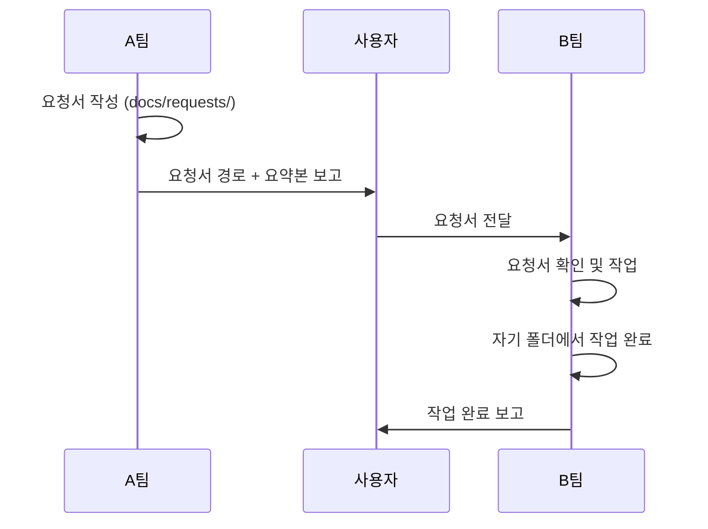

# Sparklio V4 팀별 책임 분담 (Team Responsibilities)

## 목차
- [기본 원칙](#기본-원칙)
- [A팀: 인프라 & 운영](#a팀-인프라--운영)
- [B팀: Backend 개발](#b팀-backend-개발)
- [C팀: Frontend 개발](#c팀-frontend-개발)
- [협업 프로세스](#협업-프로세스)
- [FAQ](#faq)

---

## 기본 원칙

### 🚨 절대 규칙

1. **각 팀은 자기 영역만 수정합니다**
   - A팀은 `backend/app/` 코드 수정 금지
   - B팀은 `.env` 값 수정 금지
   - C팀은 `backend/` 수정 금지

2. **다른 팀 영역 수정이 필요하면 수정 요청서 작성**
   - 템플릿: `docs/templates/MODIFICATION_REQUEST_TEMPLATE.md`
   - 저장 위치: `docs/requests/`

3. **모든 요청서는 사용자를 통해 전달**
   - 요청서 작성 후 → 사용자에게 보고
   - 사용자가 대상 팀에게 전달

---

## A팀: 인프라 & 운영

### ✅ 담당 영역

#### 1. 서버 인프라 관리
| 작업 | 설명 | 위치 |
|------|------|------|
| PostgreSQL 설치 | DB 서버 설치 및 DB/유저 생성 | Mac mini 직접 |
| Redis 설치 | 캐시 서버 설치 및 설정 | Mac mini 직접 |
| MinIO 설치 | Object Storage 설치 및 버킷 생성 | Mac mini 직접 |
| 포트 관리 | 방화벽, 포트 개방 | Mac mini 직접 |

#### 2. 배포 자동화
| 작업 | 파일 | 설명 |
|------|------|------|
| 동기화 스크립트 | `scripts/sync_to_macmini.sh` | SSD → Mac mini 동기화 |
| 모니터링 스크립트 | `scripts/start_monitoring.sh` | 서비스 시작/중지 |
| 백업 스크립트 | `scripts/backup_daily.sh` | 자동 백업 |

#### 3. 운영 문서
| 문서 | 위치 | 설명 |
|------|------|------|
| 롤백 절차 | `docs/operations/ROLLBACK_PROCEDURES.md` | 배포 롤백 가이드 |
| 재해 복구 | `docs/operations/DISASTER_RECOVERY_PLAN.md` | DR 절차 |
| 성능 튜닝 | `docs/operations/PERFORMANCE_TUNING_GUIDE.md` | 성능 최적화 |
| 모니터링 설정 | `docs/MONITORING_INFRASTRUCTURE_SETUP.md` | Superset, Prometheus 설정 |

#### 4. 환경 설정 (값만!)
| 파일 | 담당 내용 | 금지 사항 |
|------|-----------|-----------|
| `backend/.env` | IP, 패스워드, 포트 등 실제 값 | 변수명 추가/삭제 금지 |
| `frontend/.env.local` | Backend API URL 등 | 코드 로직 금지 |

### ❌ 금지 영역

- `backend/app/` - Backend 코드 수정 금지
- `frontend/src/`, `frontend/components/` - Frontend 코드 수정 금지
- `requirements.txt` - Python 패키지 추가 금지 (B팀 담당)
- `package.json` - NPM 패키지 추가 금지 (C팀 담당)

### 📝 수정 요청이 필요한 경우

**예시 1**: B팀이 `config.py`에 새 환경 변수 추가
```markdown
B팀 → A팀 수정 요청서
내용: .env 파일에 CELERY_BROKER_URL 추가 요청
```

**예시 2**: A팀이 모니터링 메트릭 필요
```markdown
A팀 → B팀 수정 요청서
내용: backend/app/monitoring/prometheus_metrics.py 파일 추가 요청
첨부: 작성한 코드 초안
```

---

## B팀: Backend 개발

### ✅ 담당 영역

#### 1. Backend 애플리케이션 코드
| 작업 | 위치 | 설명 |
|------|------|------|
| API 엔드포인트 | `backend/app/api/` | FastAPI 라우터 |
| 비즈니스 로직 | `backend/app/services/` | 서비스 레이어 |
| 데이터 모델 | `backend/app/models/` | SQLAlchemy 모델 |
| Agent 구현 | `backend/app/agents/` | SmartRouter, Agents |
| 통합 클라이언트 | `backend/app/integrations/` | Ollama, ComfyUI 클라이언트 |

#### 2. 설정 및 의존성
| 파일 | 담당 내용 | 예시 |
|------|-----------|------|
| `app/core/config.py` | 환경 변수 **정의** | `APP_NAME: str` |
| `app/core/database.py` | DB 연결 로직 | `get_db()` |
| `requirements.txt` | Python 패키지 관리 | `fastapi==0.104.1` |

#### 3. 데이터베이스 마이그레이션
| 작업 | 위치 | 명령어 |
|------|------|--------|
| 마이그레이션 생성 | `alembic/versions/` | `alembic revision --autogenerate` |
| 마이그레이션 실행 | - | `alembic upgrade head` |
| 마이그레이션 롤백 | - | `alembic downgrade -1` |

### ❌ 금지 영역

- `backend/.env` - 실제 값 수정 금지 (A팀 담당)
- `scripts/` - 배포 스크립트 수정 금지 (A팀 담당)
- `docs/operations/` - 운영 문서 수정 금지 (A팀 담당)

### 📝 수정 요청이 필요한 경우

**예시 1**: 새 환경 변수 필요
```markdown
B팀 → A팀 수정 요청서
내용: .env에 CELERY_BROKER_URL=redis://localhost:6379/1 추가 요청
이유: Celery 태스크 큐 구현을 위해 필요
```

**예시 2**: PostgreSQL 확장 필요
```markdown
B팀 → A팀 수정 요청서
내용: PostgreSQL에 pgvector 확장 설치 요청
이유: 벡터 검색 기능 구현을 위해 필요
명령어: CREATE EXTENSION vector;
```

---

## C팀: Frontend 개발

### ✅ 담당 영역

#### 1. Frontend 애플리케이션 코드
| 작업 | 위치 | 설명 |
|------|------|------|
| UI 컴포넌트 | `frontend/components/` | React 컴포넌트 |
| 페이지 | `frontend/app/` | Next.js 14 페이지 |
| API 클라이언트 | `frontend/lib/api-client.ts` | Backend 연동 |
| 상태 관리 | `frontend/store/` | Zustand/Redux |
| 에디터 | `frontend/components/editor/` | Fabric.js 통합 |

#### 2. 설정 및 의존성
| 파일 | 담당 내용 | 예시 |
|------|-----------|------|
| `frontend/.env.local` | Frontend 환경 변수 | `NEXT_PUBLIC_API_URL` |
| `package.json` | NPM 패키지 관리 | `react`, `next` |
| `next.config.js` | Next.js 설정 | 빌드 설정 |

### ❌ 금지 영역

- `backend/` - Backend 코드 수정 금지 (B팀 담당)
- `scripts/` - 배포 스크립트 수정 금지 (A팀 담당)

### 📝 수정 요청이 필요한 경우

**예시 1**: Backend API 수정 요청
```markdown
C팀 → B팀 수정 요청서
내용: GET /api/v1/workflows 엔드포인트에 pagination 추가 요청
현재: 모든 데이터 반환
필요: ?page=1&page_size=20 파라미터 지원
```

**예시 2**: Laptop 환경 설정 요청
```markdown
C팀 → A팀 수정 요청서
내용: Laptop(192.168.0.101)에 Node.js 18 설치 요청
이유: Next.js 14 실행을 위해 필요
```

---

## 협업 프로세스

### 1. 수정 요청서 작성 프로세스



### 2. 수정 요청서 파일명 규칙

```
REQ-[번호]-[요청팀]-to-[대상팀]-[간단설명].md

예시:
- REQ-001-A-to-B-add-prometheus-metrics.md
- REQ-002-B-to-A-add-env-variable.md
- REQ-003-C-to-B-add-pagination-api.md
```

### 3. 요청서 보고 형식 (사용자에게)

```markdown
## 📮 수정 요청서 발송

**요청 팀**: A팀
**대상 팀**: B팀
**요청서 경로**: `docs/requests/REQ-001-A-to-B-add-prometheus-metrics.md`

### 요약
Backend에 Prometheus 메트릭 수집 파일 추가 요청
- 파일: `backend/app/monitoring/prometheus_metrics.py`
- 이유: 시스템 모니터링을 위해 필요
- 첨부: A팀이 작성한 코드 초안 포함

**대상 팀에게 전달 부탁드립니다.**
```

---

## FAQ

### Q1: .env 파일은 누가 관리하나요?
**A**:
- **변수명 추가/삭제**: B팀 (config.py에서 정의)
- **실제 값 설정**: A팀 (.env 파일 수정)
- **협업**: B팀이 새 변수 추가 시 → A팀에게 수정 요청

### Q2: 모니터링 코드는 누가 작성하나요?
**A**:
- **코드 작성**: B팀 (backend/app/monitoring/)
- **모니터링 인프라**: A팀 (Prometheus, Grafana 설치)
- **협업**: A팀이 초안 작성 → B팀에게 수정 요청 → B팀이 코드로 구현

### Q3: Database 마이그레이션은 누가 실행하나요?
**A**:
- **마이그레이션 파일 작성**: B팀
- **마이그레이션 실행**: B팀 (alembic upgrade head)
- **DB 설치 및 유저 생성**: A팀

### Q4: 충돌이 발생하면 어떻게 하나요?
**A**:
1. 먼저 이 문서 확인 (책임 분담)
2. 불명확하면 사용자에게 문의
3. 필요 시 수정 요청서 작성

### Q5: 긴급 수정이 필요하면?
**A**:
- 수정 요청서에 우선순위 `High` 표시
- 사용자에게 즉시 보고
- 대상 팀이 최우선 처리

---

**문서 버전**: 1.0
**최종 수정일**: 2025-01-15
**작성자**: A팀 (Infrastructure Team)

**다음 검토 예정일**: 2025-02-15
