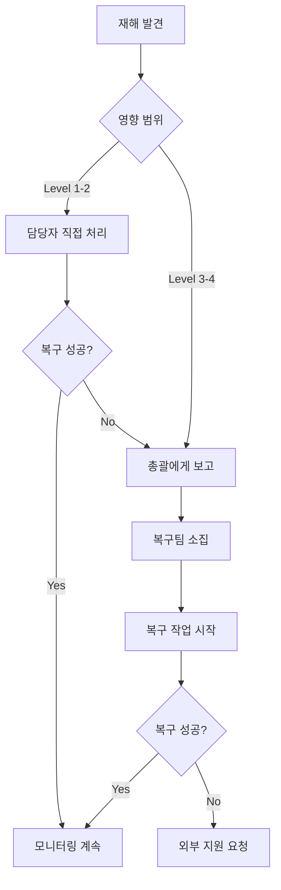

# Sparklio V4 재해 복구 계획 (Disaster Recovery Plan)

## 목차
- [개요](#개요)
- [재해 시나리오](#재해-시나리오)
- [복구 목표](#복구-목표)
- [백업 전략](#백업-전략)
- [복구 절차](#복구-절차)
- [비상 연락망](#비상-연락망)
- [정기 훈련](#정기-훈련)

---

## 개요

Sparklio V4는 3노드 하이브리드 인프라로 구성되어 있습니다. 이 문서는 하드웨어 장애, 데이터 손실, 네트워크 장애 등 재해 상황에서 시스템을 복구하는 절차를 정의합니다.

### 시스템 아키텍처

| 노드 | 역할 | 중요도 | IP |
|------|------|--------|-----|
| **Mac mini** | Backend (FastAPI, DB, Redis) | ⚠️ Critical | 100.123.51.5 |
| **Desktop** | GPU (Ollama, ComfyUI) | High | 100.120.180.42 |
| **Laptop** | Frontend (Next.js) | Medium | 192.168.0.101 |

### 재해 정의

- **Level 1**: 단일 서비스 장애 (예: Ollama 중단)
- **Level 2**: 단일 노드 장애 (예: Desktop 전원 이슈)
- **Level 3**: 다중 노드 장애 (예: 네트워크 전체 장애)
- **Level 4**: 데이터 센터 재해 (예: 화재, 침수, 전체 정전)

---

## 재해 시나리오

### 시나리오 1: Mac mini (Backend) 장애 ⚠️ CRITICAL

**영향**:
- 전체 시스템 중단
- API 요청 불가
- 데이터베이스 접근 불가
- 사용자 서비스 불가

**복구 우선순위**: 최우선 (1시간 이내)

**복구 절차**: [Mac mini 복구](#mac-mini-백엔드-복구)

---

### 시나리오 2: Desktop (GPU 서버) 장애

**영향**:
- Ollama LLM 서비스 불가
- ComfyUI 이미지 생성 불가
- Agent 실행 부분적 실패
- 기존 워크플로우 조회는 가능

**복구 우선순위**: 높음 (2시간 이내)

**복구 절차**: [Desktop GPU 복구](#desktop-gpu-복구)

---

### 시나리오 3: Laptop (Frontend) 장애

**영향**:
- 웹 UI 접근 불가
- API는 정상 작동 (직접 호출 가능)

**복구 우선순위**: 중간 (4시간 이내)

**복구 절차**: [Frontend 복구](#frontend-복구)

---

### 시나리오 4: PostgreSQL 데이터베이스 손상

**영향**:
- 사용자 데이터 손실 위험
- 워크플로우 히스토리 손실
- 브랜드 학습 데이터 손실

**복구 우선순위**: 최우선 (30분 이내)

**복구 절차**: [데이터베이스 복구](#데이터베이스-복구)

---

### 시나리오 5: MinIO 스토리지 손실

**영향**:
- 생성된 자산 파일 손실
- 브랜드 자산 손실
- 워크플로우는 작동하지만 자산 생성 불가

**복구 우선순위**: 높음 (2시간 이내)

**복구 절차**: [MinIO 복구](#minio-스토리지-복구)

---

### 시나리오 6: 전체 네트워크 장애

**영향**:
- 모든 노드 간 통신 불가
- 외부 접근 불가
- 내부 서비스 간 통신 불가

**복구 우선순위**: 최우선 (30분 이내)

**복구 절차**: [네트워크 복구](#네트워크-복구)

---

## 복구 목표

### RTO (Recovery Time Objective)

| 시스템 | RTO | 비고 |
|--------|-----|------|
| Backend (Mac mini) | 1시간 | Critical path |
| PostgreSQL | 30분 | 데이터 우선 |
| Redis | 15분 | 캐시 재구성 가능 |
| GPU Server | 2시간 | 대체 LLM 가능 |
| Frontend | 4시간 | API는 정상 작동 |
| MinIO | 2시간 | 백업에서 복구 |

### RPO (Recovery Point Objective)

| 데이터 유형 | RPO | 백업 주기 |
|------------|-----|-----------|
| PostgreSQL | 1시간 | 매시간 |
| MinIO 자산 | 24시간 | 매일 |
| Redis | 1시간 | 스냅샷 |
| 애플리케이션 코드 | 0 | Git 실시간 |
| 설정 파일 | 24시간 | 매일 |

---

## 백업 전략

### 1. 자동 백업 스크립트

```bash
#!/bin/bash
# scripts/backup_daily.sh

BACKUP_DIR="/Volumes/Backup/sparklio_v4"  # 외부 드라이브 또는 NAS
DATE=$(date +%Y%m%d_%H%M%S)

mkdir -p "$BACKUP_DIR"

echo "=== Sparklio V4 Daily Backup Started ==="

# 1. PostgreSQL 백업
echo "Backing up PostgreSQL..."
pg_dump -U sparklio_user sparklio_v4 | gzip > "$BACKUP_DIR/postgres_$DATE.sql.gz"

# 2. Redis 백업
echo "Backing up Redis..."
redis-cli SAVE
cp /var/lib/redis/dump.rdb "$BACKUP_DIR/redis_$DATE.rdb"

# 3. 환경 설정 백업
echo "Backing up configuration files..."
tar -czf "$BACKUP_DIR/config_$DATE.tar.gz" \
    ~/sparklio_ai_marketing_studio/.env \
    ~/sparklio_ai_marketing_studio/backend/.env \
    ~/sparklio_ai_marketing_studio/frontend/.env.local \
    ~/sparklio_ai_marketing_studio/monitoring/prometheus.yml

# 4. MinIO 백업 (중요 버킷만)
echo "Backing up MinIO..."
mc mirror minio/sparklio-assets "$BACKUP_DIR/minio_assets_$DATE/"
mc mirror minio/sparklio-brand-assets "$BACKUP_DIR/minio_brand_$DATE/"

# 5. Git 커밋 로그
echo "Backing up Git history..."
cd ~/sparklio_ai_marketing_studio
git log --all --pretty=format:"%H %an %ae %ai %s" > "$BACKUP_DIR/git_log_$DATE.txt"

# 6. 7일 이상 된 백업 삭제
echo "Cleaning old backups..."
find "$BACKUP_DIR" -name "postgres_*" -mtime +7 -delete
find "$BACKUP_DIR" -name "redis_*" -mtime +7 -delete
find "$BACKUP_DIR" -name "config_*" -mtime +7 -delete
find "$BACKUP_DIR" -type d -name "minio_*" -mtime +30 -exec rm -rf {} +

echo "=== Backup Complete ==="
echo "Backup location: $BACKUP_DIR"
```

### 2. Cron 설정 (Mac mini)

```bash
# 매일 새벽 2시 자동 백업
crontab -e

# 다음 줄 추가:
0 2 * * * /Users/woosun/sparklio_ai_marketing_studio/scripts/backup_daily.sh >> /Users/woosun/sparklio_ai_marketing_studio/logs/backup.log 2>&1
```

### 3. 백업 검증

```bash
#!/bin/bash
# scripts/verify_backup.sh

BACKUP_DIR="/Volumes/Backup/sparklio_v4"
LATEST_BACKUP=$(ls -t "$BACKUP_DIR"/postgres_*.sql.gz | head -1)

echo "=== Verifying Latest Backup ==="
echo "Backup file: $LATEST_BACKUP"

# PostgreSQL 백업 검증
if [ -f "$LATEST_BACKUP" ]; then
    # 압축 해제 및 SQL 문법 검증
    gunzip -c "$LATEST_BACKUP" | psql -U sparklio_user -d postgres -f - --single-transaction --set ON_ERROR_STOP=on > /dev/null 2>&1

    if [ $? -eq 0 ]; then
        echo "✓ Backup is valid"
    else
        echo "✗ Backup validation failed!"
        exit 1
    fi
else
    echo "✗ No backup file found"
    exit 1
fi
```

---

## 복구 절차

### Mac mini (Backend) 복구

#### A. 하드웨어 교체가 필요한 경우

```bash
# 1. 새 Mac mini 준비
# 2. macOS 설치
# 3. Homebrew 설치
/bin/bash -c "$(curl -fsSL https://raw.githubusercontent.com/Homebrew/install/HEAD/install.sh)"

# 4. 필수 소프트웨어 설치
brew install python@3.11 postgresql@15 redis git

# 5. PostgreSQL 초기화
brew services start postgresql@15
createdb sparklio_v4
createuser -s sparklio_user

# 6. Redis 시작
brew services start redis

# 7. 프로젝트 코드 복원
cd ~
git clone https://github.com/[YOUR_REPO]/sparklio_ai_marketing_studio.git
cd sparklio_ai_marketing_studio

# 8. Python 가상 환경 설정
cd backend
python3.11 -m venv venv
source venv/bin/activate
pip install -r requirements.txt

# 9. 환경 설정 복원
# 백업에서 .env 파일 복사
cp /Volumes/Backup/sparklio_v4/config_[LATEST]/backend/.env .

# 10. 데이터베이스 복원 (다음 섹션 참조)
```

#### B. 소프트웨어만 복구 (하드웨어 정상)

```bash
# 1. 서비스 중지
pkill -f "uvicorn"
brew services stop postgresql
brew services stop redis

# 2. 데이터베이스 복원 (아래 "데이터베이스 복구" 참조)

# 3. Redis 복원
redis-cli FLUSHALL
cp /Volumes/Backup/sparklio_v4/redis_[LATEST].rdb /var/lib/redis/dump.rdb
brew services start redis

# 4. 코드 복원
cd ~/sparklio_ai_marketing_studio
git fetch --all
git checkout main  # 또는 마지막 안정 태그
git pull

# 5. 의존성 재설치
cd backend
source venv/bin/activate
pip install -r requirements.txt

# 6. 서비스 재시작
nohup uvicorn app.main:app --host 0.0.0.0 --port 8000 > ../logs/backend.log 2>&1 &

# 7. 헬스체크
curl http://localhost:8000/health
```

---

### 데이터베이스 복구

```bash
# 1. PostgreSQL 서비스 중지
brew services stop postgresql

# 2. 기존 데이터베이스 백업 (추가 안전장치)
pg_dump sparklio_v4 > ~/emergency_backup_$(date +%Y%m%d_%H%M%S).sql

# 3. 데이터베이스 삭제 및 재생성
dropdb sparklio_v4
createdb sparklio_v4

# 4. 백업에서 복원
LATEST_BACKUP=$(ls -t /Volumes/Backup/sparklio_v4/postgres_*.sql.gz | head -1)
gunzip -c "$LATEST_BACKUP" | psql sparklio_v4

# 5. 데이터 검증
psql sparklio_v4 -c "SELECT COUNT(*) FROM users;"
psql sparklio_v4 -c "SELECT COUNT(*) FROM workflows;"
psql sparklio_v4 -c "SELECT COUNT(*) FROM agents;"

# 6. 인덱스 재구성
psql sparklio_v4 -c "REINDEX DATABASE sparklio_v4;"

# 7. 통계 업데이트
psql sparklio_v4 -c "ANALYZE;"

# 8. PostgreSQL 재시작
brew services start postgresql
```

### 데이터베이스 복구 검증 체크리스트

```markdown
- [ ] 모든 테이블 존재 확인
- [ ] 레코드 수 백업 전과 일치
- [ ] 외래키 제약 무결성 확인
- [ ] 인덱스 정상 작동
- [ ] 쿼리 성능 정상
- [ ] Backend 애플리케이션 연결 성공
```

---

### Desktop (GPU) 복구

```bash
# Desktop이 Windows인 경우

# 1. Ollama 재설치
# https://ollama.ai/download 에서 다운로드 및 설치

# 2. 모델 재다운로드
ollama pull llama2:13b
ollama pull codellama:7b
ollama pull mistral:7b

# 3. ComfyUI 재설치
cd D:\AI
git clone https://github.com/comfyanonymous/ComfyUI.git
cd ComfyUI
python -m venv venv
venv\Scripts\activate
pip install -r requirements.txt

# 4. ComfyUI 커스텀 노드 복원
cd custom_nodes
git clone https://github.com/Fannovel16/comfyui_controlnet_aux
cd comfyui_controlnet_aux
pip install -r requirements.txt

# 5. 서비스 재시작
# Ollama 자동 시작 확인
curl http://localhost:11434/api/tags

# ComfyUI 시작
cd D:\AI\ComfyUI
python main.py

# 6. Backend에서 연결 테스트
curl http://100.123.51.5:8000/api/v1/router/health
```

---

### Frontend 복구

```bash
# Laptop에서

# 1. Node.js 설치 (미설치 시)
# https://nodejs.org 에서 LTS 버전 다운로드

# 2. 프로젝트 복원
cd ~/sparklio_ai_marketing_studio
git pull

# 3. 의존성 재설치
cd frontend
npm install

# 4. 환경 변수 복원
cp /Volumes/Backup/sparklio_v4/config_[LATEST]/frontend/.env.local .

# 5. 빌드
npm run build

# 6. 서비스 시작
pm2 start npm --name "sparklio-frontend" -- start
# 또는
npm run start

# 7. 헬스체크
curl http://localhost:3000
```

---

### MinIO 스토리지 복구

```bash
# Mac mini 또는 별도 스토리지 서버

# 1. MinIO 재설치 (필요한 경우)
brew install minio

# 2. MinIO 시작
mkdir -p ~/minio/data
minio server ~/minio/data --console-address ":9001"

# 3. MinIO Client 설정
mc alias set minio http://localhost:9000 minioadmin minioadmin

# 4. 버킷 재생성
mc mb minio/sparklio-assets
mc mb minio/sparklio-brand-assets
mc mb minio/sparklio-workflows

# 5. 백업에서 복원
mc mirror /Volumes/Backup/sparklio_v4/minio_assets_[LATEST]/ minio/sparklio-assets/
mc mirror /Volumes/Backup/sparklio_v4/minio_brand_[LATEST]/ minio/sparklio-brand-assets/

# 6. 파일 수 확인
mc ls --recursive minio/sparklio-assets | wc -l
mc ls --recursive minio/sparklio-brand-assets | wc -l

# 7. Backend에서 연결 테스트
curl http://localhost:8000/api/v1/assets/health
```

---

### 네트워크 복구

```bash
# 1. 물리적 연결 확인
# - 이더넷 케이블 연결 확인
# - 스위치/라우터 전원 확인
# - Wi-Fi 라우터 재부팅

# 2. IP 주소 확인
# Mac mini
ifconfig | grep "inet "
# 기대값: 100.123.51.5

# Desktop
ipconfig
# 기대값: 100.120.180.42

# Laptop
ifconfig | grep "inet "
# 기대값: 192.168.0.101

# 3. 네트워크 테스트
# Mac mini에서
ping 100.120.180.42  # Desktop
ping 192.168.0.101  # Laptop

# Desktop에서
ping 100.123.51.5   # Mac mini

# 4. 방화벽 확인 (Mac mini)
# 시스템 환경설정 > 보안 및 개인 정보 보호 > 방화벽
# 또는
sudo /usr/libexec/ApplicationFirewall/socketfilterfw --getglobalstate

# 5. 포트 개방 확인
# Mac mini
lsof -i :8000  # Backend
lsof -i :5432  # PostgreSQL
lsof -i :6379  # Redis
lsof -i :9000  # MinIO

# Desktop
netstat -an | findstr "11434"  # Ollama
netstat -an | findstr "8188"   # ComfyUI

# 6. 서비스 재시작 (필요 시)
# 각 노드에서 서비스 재시작 (위 복구 절차 참조)
```

---

## 비상 연락망

### 재해 대응 팀

| 역할 | 이름 | 전화번호 | 이메일 | 책임 범위 |
|------|------|----------|--------|-----------|
| **재해 복구 총괄** | [이름] | [번호] | [이메일] | 전체 의사결정 |
| **시스템 관리자** | [이름] | [번호] | [이메일] | Mac mini, 인프라 |
| **Backend 담당** | [이름] | [번호] | [이메일] | FastAPI, DB, Redis |
| **GPU 서버 담당** | [이름] | [번호] | [이메일] | Ollama, ComfyUI |
| **Frontend 담당** | [이름] | [번호] | [이메일] | Next.js |
| **DBA** | [이름] | [번호] | [이메일] | PostgreSQL |
| **네트워크 담당** | [이름] | [번호] | [이메일] | 네트워크, 방화벽 |

### 에스컬레이션 절차



### 외부 지원

| 서비스 | 연락처 | 용도 |
|--------|--------|------|
| 인터넷 서비스 공급자 (ISP) | [번호] | 네트워크 장애 |
| 전기 공급자 | [번호] | 정전 |
| Apple 지원 | 1588-6880 | Mac mini 하드웨어 |
| PostgreSQL 전문가 | [번호] | DB 복구 지원 |

---

## 정기 훈련

### 월간 백업 테스트

```bash
# 매월 첫째 주 월요일
# 1. 백업 검증 스크립트 실행
./scripts/verify_backup.sh

# 2. 테스트 환경에서 복원 테스트
# (Staging 서버 또는 로컬 Docker 환경)

# 3. 결과 기록
echo "Backup test: $(date)" >> logs/backup_test.log
```

### 분기별 재해 복구 훈련

```markdown
## 재해 복구 훈련 계획

### 목표
실제 재해 상황을 시뮬레이션하여 복구 절차 검증

### 시나리오
1. Q1: Mac mini 장애 시뮬레이션
2. Q2: Desktop GPU 장애 시뮬레이션
3. Q3: 데이터베이스 손상 시뮬레이션
4. Q4: 전체 네트워크 장애 시뮬레이션

### 체크리스트
- [ ] 훈련 일정 공지 (1주 전)
- [ ] 백업 상태 확인
- [ ] 복구 절차 문서 검토
- [ ] 훈련 실시
- [ ] 복구 시간 측정 (RTO 목표 준수?)
- [ ] 문제점 기록
- [ ] 개선 사항 반영
```

---

## 부록

### 빠른 참조: 재해별 복구 순서

| 재해 | 복구 순서 | 예상 시간 |
|------|-----------|-----------|
| Mac mini 장애 | DB 복원 → Redis 복원 → Backend 시작 | 1시간 |
| Desktop 장애 | Ollama 설치 → 모델 다운로드 → ComfyUI 설치 | 2시간 |
| PostgreSQL 손상 | 백업 복원 → 인덱스 재구성 → 검증 | 30분 |
| MinIO 손상 | MinIO 재설치 → 버킷 생성 → 백업 복원 | 2시간 |
| 전체 정전 | 전원 복구 → 서비스 순차 시작 → 연결 확인 | 30분 |

### 중요 경로 (Critical Path)

```
PostgreSQL → Backend → Ollama → Frontend
```

복구는 반드시 위 순서대로 진행해야 합니다.

---

**문서 버전**: 1.0
**최종 수정일**: 2025-01-15
**작성자**: A팀 (Infrastructure Team)

**다음 검토 예정일**: 2025-04-15 (분기별 검토)
