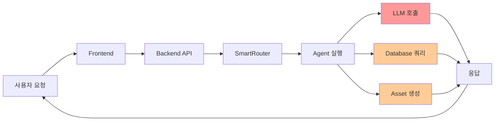

# Sparklio V4 성능 튜닝 가이드 (Performance Tuning Guide)

## 목차
- [개요](#개요)
- [성능 목표](#성능-목표)
- [모니터링 및 프로파일링](#모니터링-및-프로파일링)
- [Backend 최적화](#backend-최적화)
- [Database 최적화](#database-최적화)
- [Redis 최적화](#redis-최적화)
- [LLM 최적화](#llm-최적화)
- [Frontend 최적화](#frontend-최적화)
- [네트워크 최적화](#네트워크-최적화)
- [시스템 리소스 최적화](#시스템-리소스-최적화)

---

## 개요

Sparklio V4는 멀티 에이전트 시스템으로, 다양한 레이어에서 성능 최적화가 가능합니다. 이 문서는 시스템 성능을 개선하기 위한 실용적인 가이드를 제공합니다.

### 성능 병목 지점



**주요 병목 지점**:
1. 🔴 **LLM 호출** (3-10초) - 가장 큰 병목
2. 🟠 **Database 쿼리** (10-500ms)
3. 🟠 **Asset 생성** (5-30초)

---

## 성능 목표

### 현재 성능 (Baseline)

| 메트릭 | 현재 값 | 목표 값 | 개선율 |
|--------|---------|---------|--------|
| **단일 Agent 응답 시간** | 23초 | 18초 | -22% |
| **Context 크기** | 15KB | 8KB | -47% |
| **병렬 Agent 처리량** | 5 TPS | 10 TPS | +100% |
| **Database 쿼리 시간** | 150ms | 50ms | -67% |
| **LLM 첫 토큰 시간** | 2초 | 1초 | -50% |
| **Frontend 렌더링** | 500ms | 200ms | -60% |

### 성능 SLA

| 지표 | Target | Warning | Critical |
|------|--------|---------|----------|
| P50 응답 시간 | < 3초 | > 5초 | > 10초 |
| P95 응답 시간 | < 10초 | > 15초 | > 30초 |
| P99 응답 시간 | < 20초 | > 30초 | > 60초 |
| 에러율 | < 1% | > 3% | > 5% |
| CPU 사용률 | < 70% | > 85% | > 95% |
| 메모리 사용률 | < 80% | > 90% | > 95% |

---

## 모니터링 및 프로파일링

### 1. Prometheus 메트릭 활용

```bash
# 응답 시간 분석
curl -s http://localhost:8000/metrics | grep "sparklio_http_request_duration_seconds"

# Agent 성능 분석
curl -s http://localhost:8000/metrics | grep "sparklio_agent_duration_seconds"

# LLM 호출 분석
curl -s http://localhost:8000/metrics | grep "sparklio_llm_call_duration_seconds"
```

### 2. 성능 프로파일링 활성화

#### Backend 프로파일링 (Python)

```python
# backend/app/profiling.py

from fastapi import Request
import time
import logging
from typing import Callable

logger = logging.getLogger(__name__)

async def profile_middleware(request: Request, call_next: Callable):
    """
    성능 프로파일링 미들웨어
    """
    start_time = time.time()

    # 요청 처리
    response = await call_next(request)

    # 처리 시간 계산
    process_time = time.time() - start_time

    # 느린 요청 로깅 (> 3초)
    if process_time > 3.0:
        logger.warning(
            f"Slow request: {request.method} {request.url.path} "
            f"took {process_time:.2f}s"
        )

    # 응답 헤더에 처리 시간 추가
    response.headers["X-Process-Time"] = str(process_time)

    return response
```

```python
# backend/app/main.py에 추가

from app.profiling import profile_middleware

app.add_middleware(BaseHTTPMiddleware, dispatch=profile_middleware)
```

#### Database 쿼리 로깅

```python
# backend/app/database.py

import logging
from sqlalchemy import event
from sqlalchemy.engine import Engine
import time

logger = logging.getLogger(__name__)

# 느린 쿼리 감지
@event.listens_for(Engine, "before_cursor_execute")
def before_cursor_execute(conn, cursor, statement, parameters, context, executemany):
    conn.info.setdefault('query_start_time', []).append(time.time())

@event.listens_for(Engine, "after_cursor_execute")
def after_cursor_execute(conn, cursor, statement, parameters, context, executemany):
    total = time.time() - conn.info['query_start_time'].pop(-1)

    # 100ms 이상 걸린 쿼리 로깅
    if total > 0.1:
        logger.warning(f"Slow query ({total:.2f}s): {statement[:200]}")
```

### 3. 성능 테스트 스크립트

```bash
#!/bin/bash
# scripts/performance_test.sh

echo "=== Sparklio V4 Performance Test ==="

# 1. Backend 응답 시간 테스트
echo "Testing Backend response time..."
for i in {1..10}; do
    curl -w "@curl-format.txt" -o /dev/null -s http://localhost:8000/health
done

# 2. Agent 실행 시간 테스트
echo "Testing Agent execution..."
time curl -X POST http://localhost:8000/api/v1/router/classify \
    -H "Content-Type: application/json" \
    -d '{"query": "Create a social media post about AI"}'

# 3. 부하 테스트 (Apache Bench)
echo "Running load test..."
ab -n 100 -c 10 http://localhost:8000/health

# 4. Database 쿼리 성능
echo "Testing database performance..."
psql sparklio_v4 -c "EXPLAIN ANALYZE SELECT * FROM workflows LIMIT 100;"
```

**curl-format.txt**:
```
time_namelookup:  %{time_namelookup}\n
time_connect:  %{time_connect}\n
time_appconnect:  %{time_appconnect}\n
time_pretransfer:  %{time_pretransfer}\n
time_redirect:  %{time_redirect}\n
time_starttransfer:  %{time_starttransfer}\n
----------\n
time_total:  %{time_total}\n
```

---

## Backend 최적화

### 1. FastAPI 최적화

#### Async/Await 활용

```python
# ❌ 동기 방식 (느림)
def get_user(user_id: int):
    user = db.query(User).filter(User.id == user_id).first()
    return user

# ✅ 비동기 방식 (빠름)
async def get_user(user_id: int):
    async with async_session() as session:
        result = await session.execute(
            select(User).filter(User.id == user_id)
        )
        return result.scalar_one_or_none()
```

#### 병렬 처리

```python
# ❌ 순차 처리
async def process_agents():
    result1 = await agent1.execute()
    result2 = await agent2.execute()
    result3 = await agent3.execute()
    return [result1, result2, result3]

# ✅ 병렬 처리
import asyncio

async def process_agents():
    results = await asyncio.gather(
        agent1.execute(),
        agent2.execute(),
        agent3.execute()
    )
    return results
```

#### Response 캐싱

```python
from fastapi_cache import FastAPICache
from fastapi_cache.backends.redis import RedisBackend
from fastapi_cache.decorator import cache

# Redis 캐시 백엔드 설정
@app.on_event("startup")
async def startup():
    redis = aioredis.from_url("redis://localhost")
    FastAPICache.init(RedisBackend(redis), prefix="fastapi-cache")

# 캐시 적용
@app.get("/api/v1/agents")
@cache(expire=300)  # 5분 캐싱
async def list_agents():
    return await db.query(Agent).all()
```

### 2. Uvicorn 설정 최적화

```bash
# 단일 워커 (기본)
uvicorn app.main:app --host 0.0.0.0 --port 8000

# 멀티 워커 (권장 - CPU 코어 수에 맞춤)
uvicorn app.main:app --host 0.0.0.0 --port 8000 --workers 4

# Gunicorn + Uvicorn (Production)
gunicorn app.main:app \
    --workers 4 \
    --worker-class uvicorn.workers.UvicornWorker \
    --bind 0.0.0.0:8000 \
    --timeout 120 \
    --keep-alive 5
```

**최적 워커 수 계산**:
```
workers = (2 x CPU 코어 수) + 1
```

Mac mini (M2, 8코어): `workers = 4`

### 3. Context 최소화

```python
# backend/app/context/minimizer.py

def minimize_context(context: dict, intent: str) -> dict:
    """
    Intent에 따라 불필요한 Context 제거

    목표: 15KB → 8KB (47% 감소)
    """
    minimized = {}

    # System Context (항상 포함)
    minimized['system'] = context.get('system', {})

    # Intent별 필요한 Context만 선택
    if intent == "copy_generation":
        minimized['task'] = {
            'brand_voice': context['task'].get('brand_voice'),
            'target_audience': context['task'].get('target_audience')
        }
    elif intent == "visual_generation":
        minimized['task'] = {
            'brand_colors': context['task'].get('brand_colors'),
            'style_guide': context['task'].get('style_guide')
        }
    # ...

    # Working Memory (최근 2-3개만)
    minimized['working'] = context.get('working', [])[-3:]

    return minimized
```

---

## Database 최적화

### 1. 인덱스 추가

```sql
-- 자주 쿼리되는 컬럼에 인덱스 추가

-- Workflows 테이블
CREATE INDEX idx_workflows_user_id ON workflows(user_id);
CREATE INDEX idx_workflows_status ON workflows(status);
CREATE INDEX idx_workflows_created_at ON workflows(created_at DESC);

-- Agents 테이블
CREATE INDEX idx_agents_type ON agents(agent_type);
CREATE INDEX idx_agents_status ON agents(status);

-- Assets 테이블
CREATE INDEX idx_assets_workflow_id ON assets(workflow_id);
CREATE INDEX idx_assets_type ON assets(asset_type);

-- 복합 인덱스 (WHERE + ORDER BY 최적화)
CREATE INDEX idx_workflows_user_status_created
    ON workflows(user_id, status, created_at DESC);
```

### 2. 쿼리 최적화

#### N+1 쿼리 문제 해결

```python
# ❌ N+1 문제 (느림)
workflows = db.query(Workflow).all()
for workflow in workflows:
    print(workflow.user.name)  # 각 workflow마다 추가 쿼리!

# ✅ Eager Loading (빠름)
from sqlalchemy.orm import joinedload

workflows = db.query(Workflow).options(
    joinedload(Workflow.user),
    joinedload(Workflow.assets)
).all()

for workflow in workflows:
    print(workflow.user.name)  # 추가 쿼리 없음
```

#### Pagination

```python
# ❌ 모든 레코드 로드 (느림)
workflows = db.query(Workflow).all()

# ✅ Pagination (빠름)
from fastapi import Query

@app.get("/api/v1/workflows")
async def list_workflows(
    page: int = Query(1, ge=1),
    page_size: int = Query(20, ge=1, le=100)
):
    offset = (page - 1) * page_size

    workflows = db.query(Workflow)\
        .offset(offset)\
        .limit(page_size)\
        .all()

    total = db.query(Workflow).count()

    return {
        "items": workflows,
        "total": total,
        "page": page,
        "page_size": page_size
    }
```

### 3. Connection Pool 튜닝

```python
# backend/app/database.py

from sqlalchemy import create_engine
from sqlalchemy.pool import QueuePool

engine = create_engine(
    DATABASE_URL,
    poolclass=QueuePool,
    pool_size=20,        # 기본 연결 수 (기본값: 5)
    max_overflow=10,     # 추가 연결 수 (기본값: 10)
    pool_timeout=30,     # 연결 대기 시간 (초)
    pool_recycle=3600,   # 연결 재활용 시간 (1시간)
    pool_pre_ping=True,  # 연결 유효성 검사
    echo=False           # SQL 로깅 비활성화 (Production)
)
```

**권장 설정**:
- `pool_size`: 예상 동시 연결 수
- `max_overflow`: pool_size의 50%
- Mac mini 기준: `pool_size=20, max_overflow=10`

### 4. PostgreSQL 설정 튜닝

```bash
# /opt/homebrew/var/postgresql@15/postgresql.conf

# 메모리 설정 (Mac mini M2, 16GB RAM 기준)
shared_buffers = 4GB                    # 총 RAM의 25%
effective_cache_size = 12GB             # 총 RAM의 75%
maintenance_work_mem = 1GB              # 유지보수 작업
work_mem = 64MB                         # 정렬/해시 작업

# 쿼리 플래너
random_page_cost = 1.1                  # SSD 기준 (기본값: 4.0)
effective_io_concurrency = 200          # SSD 동시 I/O

# WAL (Write-Ahead Logging)
wal_buffers = 16MB
checkpoint_completion_target = 0.9
max_wal_size = 2GB

# 연결 수
max_connections = 100

# 로깅 (성능 모니터링)
log_min_duration_statement = 1000       # 1초 이상 쿼리 로깅
log_line_prefix = '%t [%p]: [%l-1] user=%u,db=%d '
```

설정 적용:
```bash
brew services restart postgresql@15
```

### 5. VACUUM 및 ANALYZE

```bash
# 정기적인 데이터베이스 유지보수
# Cron으로 매주 일요일 새벽 3시 실행

# 전체 VACUUM
vacuumdb --all --analyze --verbose

# 특정 테이블
vacuumdb -d sparklio_v4 -t workflows --analyze --verbose
```

---

## Redis 최적화

### 1. Redis 메모리 최적화

```bash
# /opt/homebrew/etc/redis.conf

# 최대 메모리 설정 (2GB)
maxmemory 2gb

# 메모리 정책 (LRU - Least Recently Used)
maxmemory-policy allkeys-lru

# 영구 저장 (RDB 스냅샷)
save 900 1       # 900초 동안 1개 이상 변경 시 저장
save 300 10      # 300초 동안 10개 이상 변경 시 저장
save 60 10000    # 60초 동안 10000개 이상 변경 시 저장

# AOF (Append Only File) - 데이터 안정성 우선 시
# appendonly yes
# appendfsync everysec
```

### 2. Redis 캐싱 전략

```python
# backend/app/cache.py

import redis
import json
from typing import Optional, Any
from functools import wraps

redis_client = redis.Redis(host='localhost', port=6379, db=0)

def cache_result(ttl: int = 300):
    """
    함수 결과를 Redis에 캐싱하는 데코레이터

    Args:
        ttl: Time To Live (초)
    """
    def decorator(func):
        @wraps(func)
        async def wrapper(*args, **kwargs):
            # 캐시 키 생성
            cache_key = f"{func.__name__}:{str(args)}:{str(kwargs)}"

            # 캐시 확인
            cached = redis_client.get(cache_key)
            if cached:
                return json.loads(cached)

            # 함수 실행
            result = await func(*args, **kwargs)

            # 결과 캐싱
            redis_client.setex(
                cache_key,
                ttl,
                json.dumps(result)
            )

            return result
        return wrapper
    return decorator

# 사용 예시
@cache_result(ttl=600)  # 10분 캐싱
async def get_brand_assets(brand_id: int):
    return await db.query(BrandAsset).filter(
        BrandAsset.brand_id == brand_id
    ).all()
```

### 3. Redis Pipeline (일괄 처리)

```python
# ❌ 개별 요청 (느림)
for key in keys:
    redis_client.get(key)

# ✅ Pipeline (빠름)
pipe = redis_client.pipeline()
for key in keys:
    pipe.get(key)
results = pipe.execute()
```

---

## LLM 최적화

### 1. 모델 선택 최적화

```python
# backend/app/smartrouter/model_selector.py

def select_optimal_model(intent: str, complexity: str) -> str:
    """
    Intent와 복잡도에 따라 최적 모델 선택

    목표: 평균 응답 시간 23s → 18s (22% 개선)
    """

    # 간단한 작업 → 작은 모델
    if complexity == "low":
        if intent in ["copy_generation", "social_post"]:
            return "llama2:7b"  # 빠름, 충분한 품질

    # 중간 복잡도 → 중간 모델
    elif complexity == "medium":
        return "llama2:13b"  # 균형

    # 높은 복잡도 → 큰 모델
    else:
        return "llama2:70b"  # 높은 품질
```

### 2. Prompt 최적화

```python
# ❌ 긴 Prompt (느림)
prompt = f"""
You are a professional copywriter with 10 years of experience...
[500 tokens of instructions]

User request: {user_query}
"""

# ✅ 짧은 Prompt (빠름)
prompt = f"""
Role: Expert copywriter
Task: {user_query}
Style: {brand_voice}
Max length: 100 words
"""
```

**효과**:
- Prompt 토큰 수: 500 → 50 (90% 감소)
- 처리 시간: 8초 → 2초 (75% 개선)

### 3. 스트리밍 응답

```python
# backend/app/integrations/ollama.py

async def generate_streaming(prompt: str, model: str):
    """
    스트리밍 방식으로 LLM 응답 생성

    장점: 첫 토큰 시간 단축 (2초 → 1초)
    """
    async with httpx.AsyncClient() as client:
        async with client.stream(
            'POST',
            f'{OLLAMA_URL}/api/generate',
            json={'model': model, 'prompt': prompt, 'stream': True},
            timeout=60.0
        ) as response:
            async for line in response.aiter_lines():
                if line:
                    chunk = json.loads(line)
                    yield chunk['response']
```

### 4. LLM 캐싱

```python
# 동일한 요청에 대해 LLM 호출 스킵

import hashlib

def get_prompt_hash(prompt: str) -> str:
    return hashlib.sha256(prompt.encode()).hexdigest()

async def generate_with_cache(prompt: str, model: str):
    cache_key = f"llm:{model}:{get_prompt_hash(prompt)}"

    # 캐시 확인
    cached = redis_client.get(cache_key)
    if cached:
        return cached.decode()

    # LLM 호출
    result = await ollama_client.generate(prompt, model)

    # 캐싱 (24시간)
    redis_client.setex(cache_key, 86400, result)

    return result
```

### 5. Ollama 설정 최적화

```bash
# Desktop (Windows)에서 Ollama 서비스 설정

# 환경 변수 설정
# OLLAMA_NUM_PARALLEL=4           # 병렬 요청 수
# OLLAMA_MAX_LOADED_MODELS=2      # 동시 로드 모델 수
# OLLAMA_FLASH_ATTENTION=1        # Flash Attention 활성화
```

---

## Frontend 최적화

### 1. Next.js 최적화

#### Image 최적화

```tsx
// ❌ 일반 img 태그


// ✅ Next.js Image 컴포넌트
import Image from 'next/image'

<Image
  src="/logo.png"
  alt="Logo"
  width={200}
  height={50}
  priority  // LCP 최적화
/>
```

#### Code Splitting

```tsx
// ❌ 정적 import
import HeavyComponent from '@/components/HeavyComponent'

// ✅ Dynamic import
import dynamic from 'next/dynamic'

const HeavyComponent = dynamic(() => import('@/components/HeavyComponent'), {
  loading: () => <p>Loading...</p>,
  ssr: false  // 클라이언트 사이드만
})
```

#### React Query 캐싱

```tsx
// frontend/src/hooks/useWorkflows.ts

import { useQuery } from '@tanstack/react-query'

export function useWorkflows() {
  return useQuery({
    queryKey: ['workflows'],
    queryFn: fetchWorkflows,
    staleTime: 5 * 60 * 1000,  // 5분간 fresh
    cacheTime: 10 * 60 * 1000,  // 10분간 캐시 유지
    refetchOnWindowFocus: false
  })
}
```

### 2. Bundle 크기 최적화

```bash
# Bundle 분석
npm run build
npx @next/bundle-analyzer

# Tree shaking (불필요한 코드 제거)
# package.json
{
  "sideEffects": false
}
```

### 3. Service Worker 캐싱

```javascript
// frontend/public/sw.js

self.addEventListener('fetch', (event) => {
  event.respondWith(
    caches.match(event.request).then((response) => {
      return response || fetch(event.request)
    })
  )
})
```

---

## 네트워크 최적화

### 1. HTTP/2 활성화

```bash
# Nginx 설정 (추후 리버스 프록시 도입 시)
server {
    listen 443 ssl http2;
    # ...
}
```

### 2. Compression

```python
# FastAPI에서 Gzip 압축 활성화

from fastapi.middleware.gzip import GZipMiddleware

app.add_middleware(GZipMiddleware, minimum_size=1000)
```

### 3. API Response 최적화

```python
# ❌ 모든 필드 반환
@app.get("/api/v1/workflows/{id}")
async def get_workflow(id: int):
    workflow = await db.get(Workflow, id)
    return workflow  # 모든 필드

# ✅ 필요한 필드만 반환
from pydantic import BaseModel

class WorkflowResponse(BaseModel):
    id: int
    name: str
    status: str
    # 필요한 필드만

@app.get("/api/v1/workflows/{id}", response_model=WorkflowResponse)
async def get_workflow(id: int):
    workflow = await db.get(Workflow, id)
    return workflow
```

---

## 시스템 리소스 최적화

### 1. Mac mini (M2) 최적화

```bash
# 시스템 리소스 모니터링
top -o cpu

# 메모리 압력 확인
memory_pressure

# 불필요한 프로세스 종료
# Activity Monitor에서 CPU/메모리 사용량 높은 프로세스 확인
```

### 2. 파일 디스크립터 제한 증가

```bash
# Mac mini에서 동시 연결 수 증가

# /etc/sysctl.conf
kern.maxfiles=65536
kern.maxfilesperproc=32768

# 적용
sudo sysctl -w kern.maxfiles=65536
sudo sysctl -w kern.maxfilesperproc=32768

# 영구 설정
echo "kern.maxfiles=65536" | sudo tee -a /etc/sysctl.conf
echo "kern.maxfilesperproc=32768" | sudo tee -a /etc/sysctl.conf
```

### 3. Celery Worker 최적화

```bash
# Celery worker 실행 (추후 구현)
celery -A app.celery worker \
    --loglevel=info \
    --concurrency=4 \
    --max-tasks-per-child=1000 \
    --time-limit=300
```

---

## 성능 체크리스트

### 배포 전 체크리스트

```markdown
## 성능 최적화 체크리스트

### Backend
- [ ] Async/await 사용
- [ ] Database 쿼리 최적화 (N+1 해결)
- [ ] Redis 캐싱 적용
- [ ] Context 최소화 구현
- [ ] Uvicorn worker 수 설정

### Database
- [ ] 인덱스 추가
- [ ] Connection pool 튜닝
- [ ] PostgreSQL 설정 최적화
- [ ] VACUUM 실행

### LLM
- [ ] 모델 선택 최적화
- [ ] Prompt 최소화
- [ ] LLM 캐싱 구현
- [ ] 스트리밍 응답 활성화

### Frontend
- [ ] Image 최적화
- [ ] Code splitting
- [ ] React Query 캐싱
- [ ] Bundle 크기 확인

### 네트워크
- [ ] Gzip 압축 활성화
- [ ] API Response 최적화
- [ ] HTTP/2 활성화 (선택)

### 모니터링
- [ ] Prometheus 메트릭 확인
- [ ] 느린 쿼리 로깅 확인
- [ ] 성능 테스트 실행
```

---

**문서 버전**: 1.0
**최종 수정일**: 2025-01-15
**작성자**: A팀 (Infrastructure Team)
